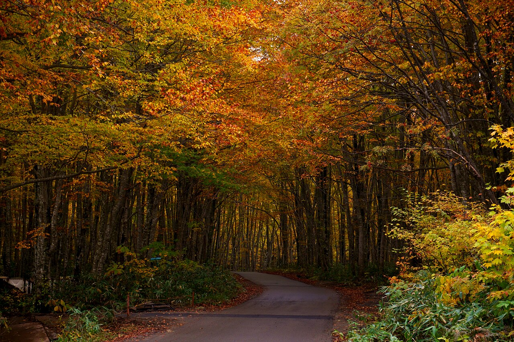

<nav class="crumb"><a href="/">子連れ宿ナビ</a> › <a href="/areas/愛媛県/">愛媛県</a> › 松山市</nav>
<header class="hero">
<figure class="ph"><figcaption class="credit">画像: 楽天トラベル</figcaption></figure>
<a href="https://hb.afl.rakuten.co.jp/hgc/52ba661c.11c9d9e2.52ba661d.9fa5c02a/?pc=https%3A%2F%2Fimg.travel.rakuten.co.jp%2Fimage%2Ftr%2Fapi%2Fif%2FuPw0Q%2F%3Ff_no%3D13653" target="_blank" rel="nofollow sponsored">▶ この宿の空室・料金を見る（楽天トラベルで見る）</a>

<h1>道後温泉　ホテル椿館｜松山市の子連れにやさしい宿</h1>

愛媛県松山市道後鷺谷町5-32 ・ 1泊 8,800円〜

★4.51 （楽天トラベル 口コミ2006件）

</header>

5つ星☆明治レトロの趣きあふれる宿で、ビュッフェと会席の選択可能！家族旅にもカップルにも★

道後温泉　ホテル椿館は、松山市にある総合★4.51（楽天トラベルの口コミ2006件）の宿です。子連れ・赤ちゃん連れのご家族からは、「子供が遊べる施設が充実」・「子供が騒いでも大丈夫」といった点が口コミで支持されています。このページでは、楽天トラベルの口コミから子連れ目線のポイントをまとめました（1泊 8,800円〜）。

🍼

◎ お世話

ベビー用品・お世話しやすい設備

🛡️

○ 安全・添い寝

添い寝・小さな子も安心の部屋

🍚

◎ 食事・アレルギー

離乳食・アレルギー・部屋食など

<h2>口コミでわかる、子連れにおすすめな理由</h2>

接客「気配りが素晴らしく、子連れの私達には嬉しい対応でした」

設備「3歳の子連れでしたが、補助便座やオムツ用ゴミ箱も用意してくださり、ロビーにもキッズスペースがあって助かりました」

遊び「小さい子どもたちも、豪華なお子様プレートで好きな物がたくさんあって喜んで食べていました」

食事「夕食は海のものを中心に子供も、シニアも満遍なく対応されてます」

子連れ歓迎「他にも、ホテルのサービスに子供も私たちも大喜びでした」

設備「子ども用石鹸の貸し出しあり助かりました」

— 楽天トラベルの口コミより（実際に泊まったご家族の声）

<h2>この宿、子供にうれしい</h2>

👶 子供が遊べる施設が充実

遊び場やアクティビティで、子供を退屈させない

👶 スタッフが子供に優しい

子供にも気さくに接してくれる、あたたかい宿

<h2>パパママにうれしい</h2>

☺️ 子供が騒いでも大丈夫

多少さわいでも、気兼ねなく過ごせる雰囲気

☺️ ベビーベッド完備

持ち込み不要で、赤ちゃん連れも身軽に泊まれる

この宿の「子連れにいい」の根拠（口コミ・公式情報）
<ul><li>口コミ3歳の子連れでしたが、補助便座やオムツ用ゴミ箱も用意してくださり、ロビーにもキッズスペースがあって助かりました</li><li>口コミ外国人の方でしたが、子供にも話しかけてくれてそのお心遣いが嬉しかったです</li><li>口コミ息子夫婦との旅行で孫がいたため個室を希望していたため周りを気にせず落ち着いて美味しい食事ができました</li><li>口コミねんね期のお子様にはベビーベッドも用意されてありました</li></ul>

<h2>お部屋</h2><figure class="ph"><figcaption class="credit">画像: 楽天トラベル</figcaption></figure>
<a href="https://hb.afl.rakuten.co.jp/hgc/52ba661c.11c9d9e2.52ba661d.9fa5c02a/?pc=https%3A%2F%2Fimg.travel.rakuten.co.jp%2Fimage%2Ftr%2Fapi%2Fif%2FuPw0Q%2F%3Ff_no%3D13653" target="_blank" rel="nofollow sponsored">▶ 客室つきプランを見る（楽天トラベルで見る）</a>

<h2>子連れにうれしい設備</h2>
湯沸かしポット

<h2>お食事</h2><figure class="ph"><figcaption class="credit">※写真はイメージです</figcaption></figure>
夕食はお部屋（部屋食）・レストラン(バイキング)で。食事の口コミ評価は★4.65

<h2>お風呂</h2><figure class="ph"><figcaption class="credit">※写真はイメージです</figcaption></figure>
大浴場・露天風呂など。お風呂の口コミ評価は★4.46

<h2>子連れ目線の評価</h2>

食事4.65

お風呂4.46

客室4.52

接客4.61

立地4.43

設備4.41

<h2>泊まった人の声</h2><blockquote class="rev">「ビュッフェも種類豊富でおいしく子どものエプロンや食器も置いてあり助かりました」<cite>— 楽天トラベルの口コミより</cite></blockquote>

<h2>ほかにも、こんな口コミがありました</h2><ul class="voices"><li>子連れ歓迎「大人用はもちろん子ども達への配慮もちゃんとあり、赤ちゃん連れでも安心して泊まれるお宿だと思いました」</li><li>設備「子どものアメニティもみきゃんの袋に入っていてとても可愛く喜んでいました」</li><li>子連れ歓迎「また、子供用の浴衣姿やスリッパもあり子供がとてもよろこんでいました」</li><li>遊び「子どもにも良く接して下さり家族全員喜んでおりました」</li><li>接客「到着してすぐにスタッフの方が子どもたちの浴衣のサイズ選びを楽しくサポートしてくださり、子どもたちは大喜び」</li><li>食事「息子夫婦との旅行で孫がいたため個室を希望していたため周りを気にせず落ち着いて美味しい食事ができました」</li></ul>
— いずれも楽天トラベルに寄せられた、実際に泊まったご家族の声です。

<h2>よくある質問</h2>

赤ちゃん・子供の食事はどうなりますか？

道後温泉　ホテル椿館の夕食はお部屋（部屋食）・レストラン(バイキング)でいただけます。食事の口コミ評価は★4.65です。口コミには「息子夫婦との旅行で孫がいたため個室を希望していたため周りを気にせず落ち着いて美味しい食事ができました」といった声もありました。離乳食やアレルギー対応は宿により異なるため、予約時にご確認ください。

子連れでもお風呂に入りやすいですか？

道後温泉　ホテル椿館には大浴場・露天風呂などがあります。貸切・家族風呂があれば、まわりを気にせず子供と入れます。

道後温泉　ホテル椿館は子連れ・赤ちゃん連れにおすすめですか？

松山市にある道後温泉　ホテル椿館は、楽天トラベルの口コミ2006件で総合★4.51。本ページでは、その口コミから子連れ目線で評価の高かったポイントをまとめています。

<h2>このエリアの雰囲気</h2><figure class="ph"><figcaption class="credit">※写真はイメージです</figcaption></figure>

★4.51・口コミ2006件のこの宿、空いてる日をチェック

<a class="btn" href="https://hb.afl.rakuten.co.jp/hgc/52ba661c.11c9d9e2.52ba661d.9fa5c02a/?pc=https%3A%2F%2Fimg.travel.rakuten.co.jp%2Fimage%2Ftr%2Fapi%2Fif%2FuPw0Q%2F%3Ff_no%3D13653" target="_blank" rel="nofollow sponsored">
空室・料金を楽天トラベルで見る →</a>
<a href="https://hb.afl.rakuten.co.jp/hgc/52ba661c.11c9d9e2.52ba661d.9fa5c02a/?pc=https%3A%2F%2Fimg.travel.rakuten.co.jp%2Fimage%2Ftr%2Fapi%2Fif%2FuPw0Q%2F%3Ff_no%3D13653" target="_blank" rel="nofollow sponsored">料金・割引クーポンも見る →</a>

※当サイトは楽天トラベルのアフィリエイトプログラムを利用しています。

#子連れ旅行 #子連れ温泉 #子連れ宿 #家族旅行 #赤ちゃん連れ旅行 #子連れ旅 #温泉旅行 #子連れお出かけ #ファミリー旅行 #子連れ宿ナビ

<footer class="credits"><h3>イメージ写真クレジット</h3><ul><li>Breakfast at Tamahan Ryokan, Kyoto.jpg by MichaelMaggs / CC BY-SA 3.0（<a href="https://upload.wikimedia.org/wikipedia/commons/thumb/f/f7/Breakfast_at_Tamahan_Ryokan%2C_Kyoto.jpg/1280px-Breakfast_at_Tamahan_Ryokan%2C_Kyoto.jpg" rel="nofollow">出典</a>）</li><li>Bokido of Hotel Urashima01o4592.jpg by 663highland / CC BY 2.5（<a href="https://upload.wikimedia.org/wikipedia/commons/thumb/a/a2/Bokido_of_Hotel_Urashima01o4592.jpg/1280px-Bokido_of_Hotel_Urashima01o4592.jpg" rel="nofollow">出典</a>）</li><li>Beech forest in Nyuto Onsenkyo (1).jpg by 掬茶 / CC BY-SA 4.0（<a href="wikimedia" rel="nofollow">出典</a>）</li></ul></footer>
