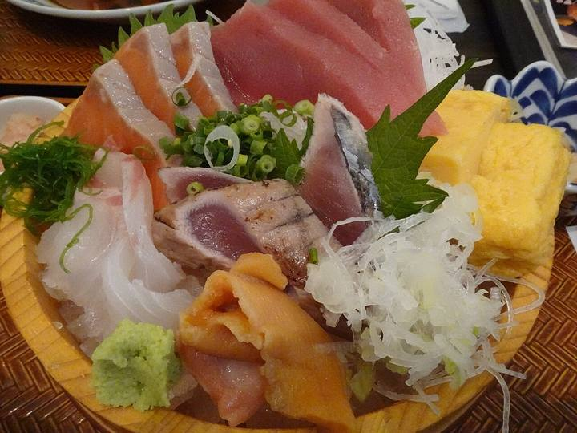

<nav class="crumb"><a href="/">子連れ宿ナビ</a> › <a href="/areas/福井県/">福井県</a> › 小浜市</nav>
<header class="hero">
<figure class="ph"><figcaption class="credit">画像: 楽天トラベル</figcaption></figure>
<a href="https://hb.afl.rakuten.co.jp/hgc/52ba661c.11c9d9e2.52ba661d.9fa5c02a/?pc=https%3A%2F%2Fimg.travel.rakuten.co.jp%2Fimage%2Ftr%2Fapi%2Fif%2FuPw0Q%2F%3Ff_no%3D13898" target="_blank" rel="nofollow sponsored">▶ この宿の空室・料金を見る（楽天トラベルで見る）</a>

<h1>四季彩の宿　花椿｜小浜市の子連れにやさしい宿</h1>

福井県小浜市小浜白鳥72-1 ・ 1泊 10,450円〜

★4.5 （楽天トラベル 口コミ107件）

</header>

若狭小浜湾の魅力が満載、展望温泉とプライベートサウナで癒しの旅をお届け＜全室オーシャンビュー＞

四季彩の宿　花椿は、小浜市にある総合★4.5（楽天トラベルの口コミ107件）の宿です。子連れ・赤ちゃん連れのご家族からは、「ゆったりした客室」・「子連れに優しい接客」といった点が口コミで支持されています。このページでは、楽天トラベルの口コミから子連れ目線のポイントをまとめました（1泊 10,450円〜）。

🍼

○ お世話

ベビー用品・お世話しやすい設備

🛡️

○ 安全・添い寝

添い寝・小さな子も安心の部屋

🍚

○ 食事・アレルギー

離乳食・アレルギー・部屋食など

<h2>口コミでわかる、子連れにおすすめな理由</h2>

接客「宿につくなりこどもの機嫌が大変悪くご迷惑をおかけしましたが、スタッフの女性のかたが子どもをあやしたり優しく対応してくださったので大変ありがたかったです」

食事「その後、子どもが寝そうになり、夕食を予定時刻より1つ早い時間に変更してほしいとお願いすると、優しく対応してくださりました」

子連れ歓迎「景観も良く、目の前が浜辺なので、子どもが海に少し入りたい時も凄く便利でした」

遊び「とても美味しく、子供も喜んでいました」

子連れ歓迎「ごはんも大人は懐石料理、娘はお子さまランチにしてもらって助かりました」

食事「夕食中、子供の相手をして頂き、ゆっくり食べる時間を頂いてありがとうございました」

— 楽天トラベルの口コミより（実際に泊まったご家族の声）

<h2>この宿、子供にうれしい</h2>

👶 ゆったりした客室

お部屋が広くて、子供ものびのび過ごせる

<h2>パパママにうれしい</h2>

☺️ 子連れに優しい接客

口コミでも子連れへの心配りが高評価

この宿の「子連れにいい」の根拠（口コミ・公式情報）
<ul><li>公式総合★4.5（107件）</li><li>公式総合★4.5（107件）</li></ul>

<h2>お部屋</h2><figure class="ph"><figcaption class="credit">画像: 楽天トラベル</figcaption></figure>
<a href="https://hb.afl.rakuten.co.jp/hgc/52ba661c.11c9d9e2.52ba661d.9fa5c02a/?pc=https%3A%2F%2Fimg.travel.rakuten.co.jp%2Fimage%2Ftr%2Fapi%2Fif%2FuPw0Q%2F%3Ff_no%3D13898" target="_blank" rel="nofollow sponsored">▶ 客室つきプランを見る（楽天トラベルで見る）</a>

<h2>子連れにうれしい設備</h2>
加湿器(貸出)

<h2>お食事</h2><figure class="ph"><figcaption class="credit">※写真はイメージです</figcaption></figure>
夕食はレストランで。食事の口コミ評価は★4.69

<h2>お風呂</h2><figure class="ph"><figcaption class="credit">※写真はイメージです</figcaption></figure>
大浴場など。お風呂の口コミ評価は★4.18

<h2>子連れ目線の評価</h2>

食事4.69

お風呂4.18

客室4.41

接客4.56

立地4.63

設備4.26

<h2>泊まった人の声</h2><blockquote class="rev">「宿につくなりこどもの機嫌が大変悪くご迷惑をおかけしましたが、スタッフの女性のかたが子どもをあやしたり優しく対応してくださったので大変ありがたかったです」<cite>— 楽天トラベルの口コミより</cite></blockquote>

<h2>ほかにも、こんな口コミがありました</h2><ul class="voices"><li>子連れ歓迎「昼前から現地に着いて、小浜駅近くの大型スーパーで食材を買い込み、ビーチ近くの無料駐車場に停めて、小学生の子どもとゆったり海水浴を楽しみました」</li><li>お部屋「恐竜プランは、お部屋にも恐竜や風船、色々グッズが入ったバッグを貰えたり、子供が大喜びで良かったです」</li><li>子連れ歓迎「子連れで利用させて頂きました♪ホテルの目の前がビーチなので、２日間思いっきり海水浴を楽しむことが出来ました」</li></ul>
— いずれも楽天トラベルに寄せられた、実際に泊まったご家族の声です。

<h2>よくある質問</h2>

赤ちゃん・子供の食事はどうなりますか？

四季彩の宿　花椿の夕食はレストランでいただけます。食事の口コミ評価は★4.69です。口コミには「その後、子どもが寝そうになり、夕食を予定時刻より1つ早い時間に変更してほしいとお願いすると、優しく対応してくださりました」といった声もありました。離乳食やアレルギー対応は宿により異なるため、予約時にご確認ください。

子連れでもお風呂に入りやすいですか？

四季彩の宿　花椿には大浴場などがあります。貸切・家族風呂があれば、まわりを気にせず子供と入れます。

四季彩の宿　花椿は子連れ・赤ちゃん連れにおすすめですか？

小浜市にある四季彩の宿　花椿は、楽天トラベルの口コミ107件で総合★4.5。本ページでは、その口コミから子連れ目線で評価の高かったポイントをまとめています。

<h2>このエリアの雰囲気</h2><figure class="ph"><figcaption class="credit">※写真はイメージです</figcaption></figure>

★4.5・口コミ107件のこの宿、空いてる日をチェック

<a class="btn" href="https://hb.afl.rakuten.co.jp/hgc/52ba661c.11c9d9e2.52ba661d.9fa5c02a/?pc=https%3A%2F%2Fimg.travel.rakuten.co.jp%2Fimage%2Ftr%2Fapi%2Fif%2FuPw0Q%2F%3Ff_no%3D13898" target="_blank" rel="nofollow sponsored">
空室・料金を楽天トラベルで見る →</a>
<a href="https://hb.afl.rakuten.co.jp/hgc/52ba661c.11c9d9e2.52ba661d.9fa5c02a/?pc=https%3A%2F%2Fimg.travel.rakuten.co.jp%2Fimage%2Ftr%2Fapi%2Fif%2FuPw0Q%2F%3Ff_no%3D13898" target="_blank" rel="nofollow sponsored">料金・割引クーポンも見る →</a>

※当サイトは楽天トラベルのアフィリエイトプログラムを利用しています。

#子連れ旅行 #子連れ温泉 #子連れ宿 #家族旅行 #赤ちゃん連れ旅行 #子連れ旅 #温泉旅行 #子連れお出かけ #ファミリー旅行 #子連れ宿ナビ

<footer class="credits"><h3>イメージ写真クレジット</h3><ul><li>AEON-Mall-Makuhari-Shintoshin 11 2021-11.jpg by RuinDig/Yuki Uchida / CC BY 4.0（<a href="https://upload.wikimedia.org/wikipedia/commons/thumb/d/d6/AEON-Mall-Makuhari-Shintoshin_11_2021-11.jpg/1280px-AEON-Mall-Makuhari-Shintoshin_11_2021-11.jpg" rel="nofollow">出典</a>）</li><li>Bokido of Hotel Urashima01o4592.jpg by 663highland / CC BY 2.5（<a href="https://upload.wikimedia.org/wikipedia/commons/thumb/a/a2/Bokido_of_Hotel_Urashima01o4592.jpg/1280px-Bokido_of_Hotel_Urashima01o4592.jpg" rel="nofollow">出典</a>）</li><li>Izu peninsula UNESCO geopark 2022 Sept 12 various 18 34 43 702000.jpeg by Nesnad / CC BY 4.0（<a href="https://upload.wikimedia.org/wikipedia/commons/thumb/2/27/Izu_peninsula_UNESCO_geopark_2022_Sept_12_various_18_34_43_702000.jpeg/1280px-Izu_peninsula_UNESCO_geopark_2022_Sept_12_various_18_34_43_702000.jpeg" rel="nofollow">出典</a>）</li></ul></footer>
