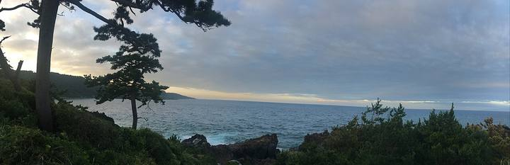

<nav class="crumb"><a href="/">子連れ宿ナビ</a> › <a href="/areas/福島県/">福島県</a> › 郡山市</nav>
<header class="hero">
<figure class="ph"><picture><source media="(max-width:739px)" srcset="https://img.travel.rakuten.co.jp/HIMG/300/15988.jpg"></picture><figcaption class="credit">画像: 楽天トラベル</figcaption></figure>
<a href="https://hb.afl.rakuten.co.jp/hgc/52ba661c.11c9d9e2.52ba661d.9fa5c02a/?pc=https%3A%2F%2Fimg.travel.rakuten.co.jp%2Fimage%2Ftr%2Fapi%2Fif%2FuPw0Q%2F%3Ff_no%3D15988" target="_blank" rel="nofollow sponsored">この宿の空室・料金を見る（楽天トラベルで見る）</a>

<h1>磐梯熱海温泉　ホテル華の湯｜郡山市の子連れにやさしい宿</h1>

福島県郡山市熱海町熱海5丁目 8-60 ・ 1泊 9,900円〜

★4.44 （楽天トラベル 口コミ3120件）

</header>

ファミリーに人気のビュッフェダイニングや、露天風呂付客室でゆったり贅沢な大人旅を！

磐梯熱海温泉　ホテル華の湯は、郡山市にある総合★4.44（楽天トラベルの口コミ3120件）の宿です。子連れ・赤ちゃん連れのご家族からは、「赤ちゃんグッズが充実」・「貸切・家族風呂」といった点が口コミで支持されています。このページでは、楽天トラベルの口コミから子連れ目線のポイントをまとめました（1泊 9,900円〜）。

◎ お世話

ベビー用品・お世話しやすい設備

○ 安全・添い寝

添い寝・小さな子も安心の部屋

◎ 食事・アレルギー

離乳食・アレルギー・部屋食など

<h2>口コミでわかる、子連れにおすすめな理由</h2>

接客「予約時間より少々早くても「大丈夫ですよ」と親切にスタッフさんが案内してくれて子供たちも喜んでいました」

食事「ベビーバスの貸し出しや、大浴場にあるシャンプーバイキングで好きなメーカーのシャンプーコンディショナーを選べます」

お風呂「そこにベビー用のボディソープなどもあり助かりました」

設備「上の子は子供用アメニティをいただいたのですが、歯ブラシセットの歯磨き粉も低年齢向けのジェルタイプだったので感動しました〜」

子連れ歓迎「5歳の子連れで、カトラリーやお手拭きを頼まなくても運んできてくれた配慮がありがたかったです」

お風呂「お風呂は10階の畳が引かれてる方が子連れには安心です」

— 楽天トラベルの口コミより（実際に泊まったご家族の声）

<h2>この宿、子供にうれしい</h2>

赤ちゃんグッズが充実

バンボやベビーバスまであって、赤ちゃん連れも手ぶらでOK

<h2>パパママにうれしい</h2>

貸切・家族風呂

人目を気にせず、子供と一緒にゆっくり入れる

客室にお風呂付き

子供を連れて大浴場まで歩かなくてOK

この宿の「子連れにいい」の根拠（口コミ・公式情報）
<ul><li>口コミベビーバスの貸し出しや、大浴場にあるシャンプーバイキングで好きなメーカーのシャンプーコンディショナーを選べます</li><li>口コミ家族風呂という名前の方の貸切風呂で、ベビーバスや赤ちゃん用のボディーソープもあり、出産してからも来られるなと思いました</li><li>公式公式: ファミリーに人気のビュッフェダイニングや、露天風呂付客室でゆったり贅沢な大人旅を</li></ul>

<h2>お部屋</h2><figure class="ph"><figcaption class="credit">画像: 楽天トラベル</figcaption></figure>
<a href="https://hb.afl.rakuten.co.jp/hgc/52ba661c.11c9d9e2.52ba661d.9fa5c02a/?pc=https%3A%2F%2Fimg.travel.rakuten.co.jp%2Fimage%2Ftr%2Fapi%2Fif%2FuPw0Q%2F%3Ff_no%3D15988" target="_blank" rel="nofollow sponsored">客室つきプランを見る（楽天トラベルで見る）</a>

<h2>子連れにうれしい設備</h2>
湯沸かしポット加湿器(貸出)湯沸かしポット(貸出)プール(夏期のみ)屋外プールゲームコーナー

<h2>お食事</h2><figure class="ph"><figcaption class="credit">※写真はイメージです</figcaption></figure>
夕食はレストラン(バイキング)・食事処で。食事の口コミ評価は★4.52

<h2>お風呂</h2><figure class="ph"><figcaption class="credit">※写真はイメージです</figcaption></figure>
大浴場・露天風呂・サウナ・家族風呂など。お風呂の口コミ評価は★4.55

<h2>子連れ目線の評価</h2>

食事4.52

お風呂4.55

客室4.47

接客4.48

立地4.32

設備4.33

<h2>泊まった人の声</h2><blockquote class="rev">「予約時間より少々早くても「大丈夫ですよ」と親切にスタッフさんが案内してくれて子供たちも喜んでいました」<cite>— 楽天トラベルの口コミより</cite></blockquote>

<h2>ほかにも、こんな口コミがありました</h2><ul class="voices"><li>食事「夕食ビュッフェは大人も子供も楽しく、美味しく頂けます」</li><li>お風呂「お風呂は露天風呂、眺望風呂が男女で入換制で沢山あるので子供達も喜んでました」</li><li>お風呂「家族風呂という名前の方の貸切風呂で、ベビーバスや赤ちゃん用のボディーソープもあり、出産してからも来られるなと思いました」</li><li>食事「宿のロビー、ご飯、お部屋、お風呂（お風呂は特に素晴らしかった）から40代の私には「あれ？子供の頃に家族旅行で来たことある」</li><li>子連れ歓迎「福島ならではの味もあり、子供たちも大満足」</li><li>接客「子連れで行ったのですが従業員の方皆さん優しくてとても良い宿でした、海外のスタッフの方もとても優しかったです」</li></ul>
— いずれも楽天トラベルに寄せられた、実際に泊まったご家族の声です。

<h2>よくある質問</h2>

赤ちゃん・子供の食事はどうなりますか？

磐梯熱海温泉　ホテル華の湯の夕食はレストラン(バイキング)・食事処でいただけます。食事の口コミ評価は★4.52です。口コミには「宿のロビー、ご飯、お部屋、お風呂（お風呂は特に素晴らしかった）から40代の私には「あれ？子供の頃に家族旅行で来たことある」といった声もありました。離乳食やアレルギー対応は宿により異なるため、予約時にご確認ください。

子連れでもお風呂に入りやすいですか？

磐梯熱海温泉　ホテル華の湯には大浴場・露天風呂・家族風呂などがあります。貸切・家族風呂があれば、まわりを気にせず子供と入れます。

磐梯熱海温泉　ホテル華の湯は子連れ・赤ちゃん連れにおすすめですか？

郡山市にある磐梯熱海温泉　ホテル華の湯は、楽天トラベルの口コミ3120件で総合★4.44。本ページでは、その口コミから子連れ目線で評価の高かったポイントをまとめています。

<h2>このエリアの雰囲気</h2><figure class="ph"><figcaption class="credit">※写真はイメージです</figcaption></figure>

★4.44・口コミ3120件のこの宿、空いてる日をチェック

<a class="btn" href="https://hb.afl.rakuten.co.jp/hgc/52ba661c.11c9d9e2.52ba661d.9fa5c02a/?pc=https%3A%2F%2Fimg.travel.rakuten.co.jp%2Fimage%2Ftr%2Fapi%2Fif%2FuPw0Q%2F%3Ff_no%3D15988" target="_blank" rel="nofollow sponsored">
空室・料金を楽天トラベルで見る →</a>
<a href="https://hb.afl.rakuten.co.jp/hgc/52ba661c.11c9d9e2.52ba661d.9fa5c02a/?pc=https%3A%2F%2Fimg.travel.rakuten.co.jp%2Fimage%2Ftr%2Fapi%2Fif%2FuPw0Q%2F%3Ff_no%3D15988" target="_blank" rel="nofollow sponsored">料金・割引クーポンも見る →</a>

※当サイトは楽天トラベルのアフィリエイトプログラムを利用しています。

#子連れ旅行 #子連れ温泉 #子連れ宿 #家族旅行 #赤ちゃん連れ旅行 #子連れ旅 #温泉旅行 #子連れお出かけ #ファミリー旅行 #子連れ宿ナビ #熱海

<footer class="credits"><h3>イメージ写真クレジット</h3><ul><li>AEON-Mall-Makuhari-Shintoshin 11 2021-11.jpg by RuinDig/Yuki Uchida / CC BY 4.0（<a href="https://upload.wikimedia.org/wikipedia/commons/thumb/d/d6/AEON-Mall-Makuhari-Shintoshin_11_2021-11.jpg/1280px-AEON-Mall-Makuhari-Shintoshin_11_2021-11.jpg" rel="nofollow">出典</a>）</li><li>Bokido of Hotel Urashima01o4592.jpg by 663highland / CC BY 2.5（<a href="https://upload.wikimedia.org/wikipedia/commons/thumb/a/a2/Bokido_of_Hotel_Urashima01o4592.jpg/1280px-Bokido_of_Hotel_Urashima01o4592.jpg" rel="nofollow">出典</a>）</li><li>Izu peninsula UNESCO geopark 2022 Sept 12 various 18 34 43 702000.jpeg by Nesnad / CC BY 4.0（<a href="https://upload.wikimedia.org/wikipedia/commons/thumb/2/27/Izu_peninsula_UNESCO_geopark_2022_Sept_12_various_18_34_43_702000.jpeg/1280px-Izu_peninsula_UNESCO_geopark_2022_Sept_12_various_18_34_43_702000.jpeg" rel="nofollow">出典</a>）</li></ul></footer>
