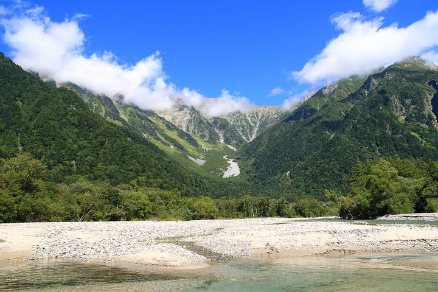

<nav class="crumb"><a href="/">子連れ宿ナビ</a> › <a href="/areas/栃木県/">栃木県</a> › 那須町</nav>
<header class="hero">
<figure class="ph"><figcaption class="credit">画像: 楽天トラベル</figcaption></figure>
<a href="https://hb.afl.rakuten.co.jp/hgc/52ba661c.11c9d9e2.52ba661d.9fa5c02a/?pc=https%3A%2F%2Fimg.travel.rakuten.co.jp%2Fimage%2Ftr%2Fapi%2Fif%2FuPw0Q%2F%3Ff_no%3D16139" target="_blank" rel="nofollow sponsored">この宿の空室・料金を見る（楽天トラベルで見る）</a>

<h1>カントリーハウス　パディントン＜栃木県＞｜那須町の子連れにやさしい宿</h1>

栃木県那須郡那須町高久乙600-103 ・ 1泊 5,000円〜

★4.61 （楽天トラベル 口コミ1295件）

</header>

７月８月好評予約受付中★6月2７日空室有★お土産付き！3０00円クーポン発行

カントリーハウス　パディントン＜栃木県＞は、那須町にある総合★4.61（楽天トラベルの口コミ1295件）の宿です。子連れ・赤ちゃん連れのご家族からは、「スタッフが子供に優しい」・「子供が騒いでも大丈夫」といった点が口コミで支持されています。このページでは、楽天トラベルの口コミから子連れ目線のポイントをまとめました（1泊 5,000円〜）。

◎ お世話

ベビー用品・お世話しやすい設備

○ 安全・添い寝

添い寝・小さな子も安心の部屋

◎ 食事・アレルギー

離乳食・アレルギー・部屋食など

<h2>口コミでわかる、子連れにおすすめな理由</h2>

お風呂「またタオル等も多めに用意してくださって、(子供が小さいとお風呂の際は枚数が必要になるので)ありがたかったです」

子連れ歓迎「子どもと大人で少し味付けを変えてくださったり、前菜からデザートまでこだわりのお料理の数々に感動しました」

接客「ペンションに泊まるのは初めてでしたが、ママさんがとても優しく親切で、子供たちのことも気にかけてくださり、とても穏やかな気持ちで過ごすことができました」

食事「騒がしい３人の子ども連れでしたが、部屋割りの調整やご飯時も柔軟に対応頂き楽しく過ごせました」

遊び「私達以上に子供達が喜んでいました」

設備「4人で広いリビングとベッドが５つもある寝室があるタイプの部屋を利用することができ孫もソファーでゆっくり楽しむことができました」

— 楽天トラベルの口コミより（実際に泊まったご家族の声）

<h2>この宿、子供にうれしい</h2>

スタッフが子供に優しい

子供にも気さくに接してくれる、あたたかい宿

子供のごはんも本格的

子供用の食事まで手を抜かない献立

<h2>パパママにうれしい</h2>

子供が騒いでも大丈夫

多少さわいでも、気兼ねなく過ごせる雰囲気

貸切・家族風呂

人目を気にせず、子供と一緒にゆっくり入れる

この宿の「子連れにいい」の根拠（口コミ・公式情報）
<ul><li>口コミ子供との接し方も慣れていて常に気にかけて下さり声をかけて下さり嬉しかったです</li><li>口コミ子どもの料理もチンしただけのものが出てくるパターンが多いですが、手作りで手が込んでおり、本当に贅沢な食事でした</li><li>口コミ人気の宿なので満室かと思いきやまさかの貸切で、騒がしい子供を持つ親としては周りを気にせず過ごせて安心しました</li><li>口コミ子どもが小さいので、貸切の大きな家族風呂が無料で使えて助かりました</li></ul>

<h2>お部屋</h2><figure class="ph"><figcaption class="credit">画像: 楽天トラベル</figcaption></figure>
<a href="https://hb.afl.rakuten.co.jp/hgc/52ba661c.11c9d9e2.52ba661d.9fa5c02a/?pc=https%3A%2F%2Fimg.travel.rakuten.co.jp%2Fimage%2Ftr%2Fapi%2Fif%2FuPw0Q%2F%3Ff_no%3D16139" target="_blank" rel="nofollow sponsored">客室つきプランを見る（楽天トラベルで見る）</a>

<h2>子連れにうれしい設備</h2>
湯沸かしポット湯沸かしポット(貸出)館内無料Ｗｉ-Ｆｉ★客室内冷蔵庫有★電気湯沸かし器有★お子様のパジャマはご持参くださいませ。館内及び客室に空間除菌装置設置★空気清浄機能付きエアコン☆客室暖房はオイルヒーター☆

<h2>お食事</h2><figure class="ph"><figcaption class="credit">※写真はイメージです</figcaption></figure>
夕食はレストランで。食事の口コミ評価は★4.81

<h2>お風呂</h2><figure class="ph"><figcaption class="credit">※写真はイメージです</figcaption></figure>
露天風呂・家族風呂など。お風呂の口コミ評価は★4.42

<h2>子連れ目線の評価</h2>

食事4.81

お風呂4.42

客室4.53

接客4.68

立地4.58

設備4.49

<h2>泊まった人の声</h2><blockquote class="rev">「子どもが小さいので、貸切の大きな家族風呂が無料で使えて助かりました」<cite>— 楽天トラベルの口コミより</cite></blockquote>

<h2>ほかにも、こんな口コミがありました</h2><ul class="voices"><li>お風呂「貸切の家族風呂だったので子連れでも入りやすかったのがとても助かりました」</li><li>子連れ歓迎「二人の小さな子連れですが、子育て経験のあるパディントンママのきめ細やかな配慮とサービスがあるので、安心して楽しく宿泊することができました」</li><li>食事「夕食会場が貸切だったので子供もオーナーさんに良くしてもらいニコニコしていたので親も楽しく食事ができました」</li><li>子連れ歓迎「子どもたちも、パディントンママがたくさん声をかけてくださったのが嬉しかったようで、思い出に残る旅行になりました♡」</li><li>お風呂「人気の宿なので満室かと思いきやまさかの貸切で、騒がしい子供を持つ親としては周りを気にせず過ごせて安心しました」</li><li>遊び「娘達をたくさん褒めて頂き、子供も喜んでました」</li></ul>
— いずれも楽天トラベルに寄せられた、実際に泊まったご家族の声です。

<h2>よくある質問</h2>

赤ちゃん・子供の食事はどうなりますか？

カントリーハウス　パディントン＜栃木県＞の夕食はレストランでいただけます。食事の口コミ評価は★4.81です。口コミには「騒がしい３人の子ども連れでしたが、部屋割りの調整やご飯時も柔軟に対応頂き楽しく過ごせました」といった声もありました。離乳食やアレルギー対応は宿により異なるため、予約時にご確認ください。

子連れでもお風呂に入りやすいですか？

カントリーハウス　パディントン＜栃木県＞には露天風呂・家族風呂などがあります。貸切・家族風呂があれば、まわりを気にせず子供と入れます。

カントリーハウス　パディントン＜栃木県＞は子連れ・赤ちゃん連れにおすすめですか？

那須町にあるカントリーハウス　パディントン＜栃木県＞は、楽天トラベルの口コミ1295件で総合★4.61。本ページでは、その口コミから子連れ目線で評価の高かったポイントをまとめています。

<h2>このエリアの雰囲気</h2><figure class="ph"><figcaption class="credit">※写真はイメージです</figcaption></figure>

★4.61・口コミ1295件のこの宿、空いてる日をチェック

<a class="btn" href="https://hb.afl.rakuten.co.jp/hgc/52ba661c.11c9d9e2.52ba661d.9fa5c02a/?pc=https%3A%2F%2Fimg.travel.rakuten.co.jp%2Fimage%2Ftr%2Fapi%2Fif%2FuPw0Q%2F%3Ff_no%3D16139" target="_blank" rel="nofollow sponsored">
空室・料金を楽天トラベルで見る →</a>
<a href="https://hb.afl.rakuten.co.jp/hgc/52ba661c.11c9d9e2.52ba661d.9fa5c02a/?pc=https%3A%2F%2Fimg.travel.rakuten.co.jp%2Fimage%2Ftr%2Fapi%2Fif%2FuPw0Q%2F%3Ff_no%3D16139" target="_blank" rel="nofollow sponsored">料金・割引クーポンも見る →</a>

※当サイトは楽天トラベルのアフィリエイトプログラムを利用しています。

#子連れ旅行 #子連れ温泉 #子連れ宿 #家族旅行 #赤ちゃん連れ旅行 #子連れ旅 #温泉旅行 #子連れお出かけ #ファミリー旅行 #子連れ宿ナビ

<footer class="credits"><h3>イメージ写真クレジット</h3><ul><li>Breakfast at Tamahan Ryokan, Kyoto.jpg by MichaelMaggs / CC BY-SA 3.0（<a href="https://upload.wikimedia.org/wikipedia/commons/thumb/f/f7/Breakfast_at_Tamahan_Ryokan%2C_Kyoto.jpg/1280px-Breakfast_at_Tamahan_Ryokan%2C_Kyoto.jpg" rel="nofollow">出典</a>）</li><li>Bokido of Hotel Urashima01o4592.jpg by 663highland / CC BY 2.5（<a href="https://upload.wikimedia.org/wikipedia/commons/thumb/a/a2/Bokido_of_Hotel_Urashima01o4592.jpg/1280px-Bokido_of_Hotel_Urashima01o4592.jpg" rel="nofollow">出典</a>）</li><li>Kamikōchi, Hida Mountains range, Nagano Prefecture; September 2007 (01).jpg by skyseeker / CC BY 2.0（<a href="https://upload.wikimedia.org/wikipedia/commons/thumb/a/a7/Kamik%C5%8Dchi%2C_Hida_Mountains_range%2C_Nagano_Prefecture%3B_September_2007_%2801%29.jpg/1280px-Kamik%C5%8Dchi%2C_Hida_Mountains_range%2C_Nagano_Prefecture%3B_September_2007_%2801%29.jpg" rel="nofollow">出典</a>）</li></ul></footer>
