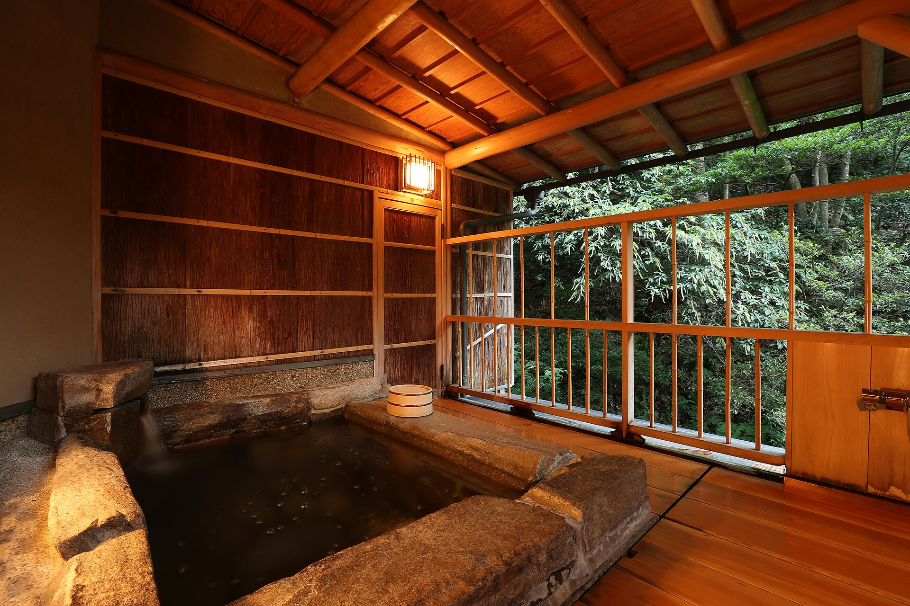

<nav class="crumb"><a href="/">子連れ宿ナビ</a> › <a href="/areas/東京都/">東京都</a> › 江東区</nav>
<header class="hero">
<figure class="ph"><picture><source media="(max-width:739px)" srcset="https://img.travel.rakuten.co.jp/HIMG/300/178230.jpg"></picture><figcaption class="credit">画像: 楽天トラベル</figcaption></figure>
<a href="https://hb.afl.rakuten.co.jp/hgc/52ba661c.11c9d9e2.52ba661d.9fa5c02a/?pc=https%3A%2F%2Fimg.travel.rakuten.co.jp%2Fimage%2Ftr%2Fapi%2Fif%2FuPw0Q%2F%3Ff_no%3D178230" target="_blank" rel="nofollow sponsored">この宿の空室・料金を見る（楽天トラベルで見る）</a>

<h1>ヴィラフォンテーヌグランド東京有明｜有明（江東区）の子連れにやさしいホテル</h1>

東京都江東区有明2-1-5 ・ 1泊 4,240円〜

★4.4 （楽天トラベル 口コミ1292件）

</header>

落ち着いた雰囲気の都市型ホテル。温浴施設と200店舗超のショップ&amp;レストラン併設

住友不動産ホテル　ヴィラフォンテーヌグランド東京有明は、江東区にある総合★4.4（楽天トラベルの口コミ1292件）の宿です。子連れ・赤ちゃん連れのご家族からは、「赤ちゃんグッズが充実」・「客室にお風呂付き」といった点が口コミで支持されています。このページでは、楽天トラベルの口コミから子連れ目線のポイントをまとめました（1泊 4,240円〜）。

○ お世話

ベビー用品・お世話しやすい設備

○ 安全・添い寝

添い寝・小さな子も安心の部屋

◎ 食事・アレルギー

離乳食・アレルギー・部屋食など

<h2>口コミでわかる、子連れにおすすめな理由</h2>

接客「当初大人２人、子供１人の宿泊予定でしたが、当日大人1名増えましたが、直ぐに対応してくれ、追加料金も思いのほかの安く済みました」

設備「サービス、アメニティー、立地条件なども良く、部屋も子連れで止まっても和洋室があるので非常に便利です」

お風呂「お風呂も広くてPigeonのベビーソープがあるので便利だと思いました」

子連れ歓迎「赤ちゃんがいる家庭でもゆっくりできる施設でした」

お部屋「お部屋は清潔感があり、小さい子供連れには嬉しい畳や、バス、トイレが別だったのがとても良かったです」

食事「朝食のビュッフェも種類が多くて、子供がすごく喜んでくれました」

— 楽天トラベルの口コミより（実際に泊まったご家族の声）

<h2>この宿、子供にうれしい</h2>

赤ちゃんグッズが充実

バンボやベビーバスまであって、赤ちゃん連れも手ぶらでOK

子供が遊べる施設が充実

遊び場やアクティビティで、子供を退屈させない

<h2>パパママにうれしい</h2>

客室にお風呂付き

子供を連れて大浴場まで歩かなくてOK

ウェルカムベビー認定

赤ちゃん連れ歓迎が、第三者に認定された宿

この宿の「子連れにいい」の根拠（口コミ・公式情報）
<ul><li>口コミ2歳と8ヶ月の子を連れて行きましたが、部屋も清潔で、おもちゃやベビーグッズを揃えてくださり、ストレスなく過ごす事ができました</li><li>口コミ隣接のショッピングセンターは子供の遊び場とレストラン/フードコートが充実</li><li>口コミ殆ど言うこと無しの至れり尽くせりでしたが、部屋のお風呂のドアがアプローチ少し厳しく、子どもの手を引いて中に入るのが少し大変でした</li><li>口コミウェルカムベビーの部屋を予約しました</li></ul>

<h2>子連れにうれしい設備</h2>
加湿器

<h2>お食事</h2><figure class="ph"><figcaption class="credit">※写真はイメージです</figcaption></figure>
夕食はレストラン(バイキング)で。食事の口コミ評価は★4.4

<h2>お風呂</h2><figure class="ph"><figcaption class="credit">※写真はイメージです</figcaption></figure>
大浴場・露天風呂・サウナ・天然温泉など。お風呂の口コミ評価は★4.4

<h2>子連れ目線の評価</h2>

食事4.4

お風呂4.4

客室4.43

接客4.37

立地4.45

設備4.37

<h2>泊まった人の声</h2><blockquote class="rev">「朝食も美味しく、キッズメニューや離乳食もあり素晴らしいと思いました」<cite>— 楽天トラベルの口コミより</cite></blockquote>

<h2>ほかにも、こんな口コミがありました</h2><ul class="voices"><li>食事「また朝食も美味しく、キッズメニューや離乳食もあり素晴らしいと思いました」</li><li>お部屋「部屋は座敷ありの部屋で小さな子どもも安心して寝かせることができて良かったです」</li><li>お部屋「部屋やレストランの窓からすぐ近くにゆりかもめが走っているのが見えて子供が喜んでいました」</li><li>子連れ歓迎「すごくキレイで清潔感もあって子連れでも安心して過ごせました」</li><li>子連れ歓迎「子供達も気に入ったみたいで、また泊まりたいと言っています」</li><li>遊び「また、座敷がついていてリラックスして遊べる上に、子供は置いてあったブロックおもちゃに大興奮」</li></ul>
— いずれも楽天トラベルに寄せられた、実際に泊まったご家族の声です。

<h2>よくある質問</h2>

赤ちゃん・子供の食事はどうなりますか？

住友不動産ホテル　ヴィラフォンテーヌグランド東京有明の夕食はレストラン(バイキング)でいただけます。食事の口コミ評価は★4.4です。口コミには「また朝食も美味しく、キッズメニューや離乳食もあり素晴らしいと思いました」といった声もありました。離乳食やアレルギー対応は宿により異なるため、予約時にご確認ください。

子連れでもお風呂に入りやすいですか？

住友不動産ホテル　ヴィラフォンテーヌグランド東京有明には大浴場・露天風呂などがあります。貸切・家族風呂があれば、まわりを気にせず子供と入れます。

住友不動産ホテル　ヴィラフォンテーヌグランド東京有明は子連れ・赤ちゃん連れにおすすめですか？

江東区にある住友不動産ホテル　ヴィラフォンテーヌグランド東京有明は、楽天トラベルの口コミ1292件で総合★4.4。本ページでは、その口コミから子連れ目線で評価の高かったポイントをまとめています。

<h2>このエリアの雰囲気</h2><figure class="ph"><figcaption class="credit">※写真はイメージです</figcaption></figure>

★4.4・口コミ1292件のこの宿、空いてる日をチェック

<a class="btn" href="https://hb.afl.rakuten.co.jp/hgc/52ba661c.11c9d9e2.52ba661d.9fa5c02a/?pc=https%3A%2F%2Fimg.travel.rakuten.co.jp%2Fimage%2Ftr%2Fapi%2Fif%2FuPw0Q%2F%3Ff_no%3D178230" target="_blank" rel="nofollow sponsored">
空室・料金を楽天トラベルで見る →</a>
<a href="https://hb.afl.rakuten.co.jp/hgc/52ba661c.11c9d9e2.52ba661d.9fa5c02a/?pc=https%3A%2F%2Fimg.travel.rakuten.co.jp%2Fimage%2Ftr%2Fapi%2Fif%2FuPw0Q%2F%3Ff_no%3D178230" target="_blank" rel="nofollow sponsored">料金・割引クーポンも見る →</a>

※当サイトは楽天トラベルのアフィリエイトプログラムを利用しています。

#子連れ旅行 #子連れ温泉 #子連れ宿 #家族旅行 #赤ちゃん連れ旅行 #子連れ旅 #温泉旅行 #子連れお出かけ #ファミリー旅行 #子連れ宿ナビ

<footer class="credits"><h3>イメージ写真クレジット</h3><ul><li>Breakfast at Tamahan Ryokan, Kyoto.jpg by MichaelMaggs / CC BY-SA 3.0（<a href="https://upload.wikimedia.org/wikipedia/commons/thumb/f/f7/Breakfast_at_Tamahan_Ryokan%2C_Kyoto.jpg/1280px-Breakfast_at_Tamahan_Ryokan%2C_Kyoto.jpg" rel="nofollow">出典</a>）</li><li>Bokido of Hotel Urashima01o4592.jpg by 663highland / CC BY 2.5（<a href="https://upload.wikimedia.org/wikipedia/commons/thumb/a/a2/Bokido_of_Hotel_Urashima01o4592.jpg/1280px-Bokido_of_Hotel_Urashima01o4592.jpg" rel="nofollow">出典</a>）</li><li>Beech forest in Nyuto Onsenkyo (1).jpg by 掬茶 / CC BY-SA 4.0（<a href="wikimedia" rel="nofollow">出典</a>）</li></ul></footer>
