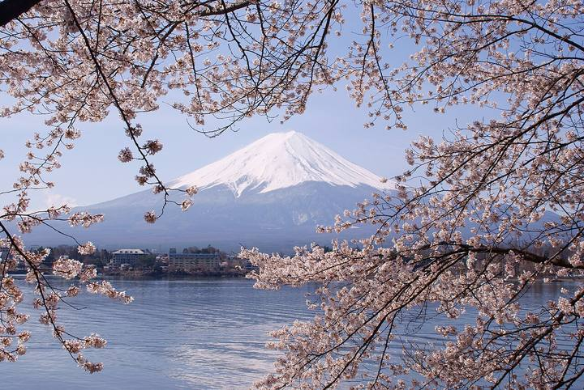

<nav class="crumb"><a href="/">子連れ宿ナビ</a> › <a href="/areas/山梨県/">山梨県</a> › 山中湖村</nav>
<header class="hero">
<figure class="ph"><picture><source media="(max-width:739px)" srcset="https://img.travel.rakuten.co.jp/HIMG/300/184648.jpg"></picture><figcaption class="credit">画像: 楽天トラベル</figcaption></figure>
<a href="https://hb.afl.rakuten.co.jp/hgc/52ba661c.11c9d9e2.52ba661d.9fa5c02a/?pc=https%3A%2F%2Fimg.travel.rakuten.co.jp%2Fimage%2Ftr%2Fapi%2Fif%2FuPw0Q%2F%3Ff_no%3D184648" target="_blank" rel="nofollow sponsored">この宿の空室・料金を見る（楽天トラベルで見る）</a>

<h1>全室富士山ビュー　ビジョングランピングリゾート山中湖｜山中湖村の子連れにやさしい宿</h1>

山梨県南都留郡山中湖村山中字栗木林１３８５－４３ ・ 1泊 28,190円〜

★4.85 （楽天トラベル 口コミ257件）

</header>

各客室内に専用の露天風呂・サウナ付き完全プライベートグランピング

全室富士山ビュー　ビジョングランピングリゾート山中湖は、山中湖村にある総合★4.85（楽天トラベルの口コミ257件）の宿です。子連れ・赤ちゃん連れのご家族からは、「焚き火や花火で大はしゃぎ」・「子供が騒いでも大丈夫」といった点が口コミで支持されています。このページでは、楽天トラベルの口コミから子連れ目線のポイントをまとめました（1泊 28,190円〜）。

◎ お世話

ベビー用品・お世話しやすい設備

○ 安全・添い寝

添い寝・小さな子も安心の部屋

◎ 食事・アレルギー

離乳食・アレルギー・部屋食など

<h2>口コミでわかる、子連れにおすすめな理由</h2>

接客「スタッフの方々の対応、サービス、施設、目の前の富士山どれも素晴らしく日常とかけ離れた体験に子供達も喜んでくれ最高の思い出となり感謝の気持ちでいっぱいです」

食事「ハイチェアの子供用のいすも用意してあるので、食事の際も助かりました◎」

設備「ベッドも低いので子供達も安心して眠れました」

遊び「焚き火、花火、バーベキューに子供たちは感動したみたいでまた泊まりたいとはしゃいでいました」

お部屋「部屋は完全プライベート空間で赤ちゃん連れでも安心です」

接客「早めに着いたのですが、子供のグズりもあって直前にアーリーチェックインをお願いさせていただいたにもかかわらず、スムーズに対応してもらえて助かりました」

— 楽天トラベルの口コミより（実際に泊まったご家族の声）

<h2>この宿、子供にうれしい</h2>

焚き火や花火で大はしゃぎ

外遊びや花火で、子供がとびきりの笑顔に

グランピング体験

テント泊やBBQが、忘れられない思い出に

<h2>パパママにうれしい</h2>

子供が騒いでも大丈夫

多少さわいでも、気兼ねなく過ごせる雰囲気

子供も安心して眠れる

低いベッドや布団で、添い寝もしやすい

この宿の「子連れにいい」の根拠（口コミ・公式情報）
<ul><li>口コミ星空、お月様見ながらの焚き火も子供達は楽しんでいました</li><li>公式公式: 山中湖｜全室富士山ビューでBBQ｜各客室内に専用の露天風呂・サウナ付き完全プライ</li><li>口コミ小さな子供2人連れですが、周りを気にせず、プライベート空間で楽しめました</li><li>口コミ子供もぐっすり眠れたと大満足</li></ul>

<h2>子連れにうれしい設備</h2>
湯沸かしポット加湿器ベビーベッド電子レンジ（一部・要予約）ミニキッチン（一部・要予約）

<h2>お食事</h2><figure class="ph"><figcaption class="credit">※写真はイメージです</figcaption></figure>
夕食はお部屋（部屋食）・ダイニングルームで。食事の口コミ評価は★4.73

<h2>お風呂</h2><figure class="ph"><figcaption class="credit">※写真はイメージです</figcaption></figure>
露天風呂・サウナ・家族風呂など。お風呂の口コミ評価は★4.83

<h2>子連れ目線の評価</h2>

食事4.73

お風呂4.83

客室4.89

接客4.81

立地4.85

設備4.77

<h2>泊まった人の声</h2><blockquote class="rev">「スタッフの方々の対応、サービス、施設、目の前の富士山どれも素晴らしく日常とかけ離れた体験に子供達も喜んでくれ最高の思い出となり感謝の気持ちでいっぱいです」<cite>— 楽天トラベルの口コミより</cite></blockquote>

<h2>ほかにも、こんな口コミがありました</h2><ul class="voices"><li>遊び「焚き火や手持ち花火、室内でジェンガも出来、子供達も大興奮」</li><li>遊び「ウッドデッキでは持参した柔らかいボールで遊べたり、花火をしたり、とにかく子供も大満足でした」</li><li>子連れ歓迎「子供は美味しいと食べてたので良かったです」</li><li>子連れ歓迎「有料の白米も土瓶で作らなければいけないので、美味しいのは間違いないとは思いますが、子供たちは待たせるにはちょっと時間が掛かりすぎるので諦めました」</li><li>お部屋「子供達が部屋に入った瞬間、大興奮でした」</li><li>お部屋「ドーム型のお部屋に子どもたちも大はしゃぎ」</li></ul>
— いずれも楽天トラベルに寄せられた、実際に泊まったご家族の声です。

<h2>よくある質問</h2>

赤ちゃん・子供の食事はどうなりますか？

全室富士山ビュー　ビジョングランピングリゾート山中湖の夕食はお部屋（部屋食）・ダイニングルームでいただけます。食事の口コミ評価は★4.73です。口コミには「ハイチェアの子供用のいすも用意してあるので、食事の際も助かりました◎」といった声もありました。離乳食やアレルギー対応は宿により異なるため、予約時にご確認ください。

ベビーベッドは借りられますか？

全室富士山ビュー　ビジョングランピングリゾート山中湖は客室設備にベビーベッドの記載があります。台数に限りがある場合があるので、予約時のリクエストがおすすめです。

子連れでもお風呂に入りやすいですか？

全室富士山ビュー　ビジョングランピングリゾート山中湖には露天風呂・家族風呂などがあります。貸切・家族風呂があれば、まわりを気にせず子供と入れます。

全室富士山ビュー　ビジョングランピングリゾート山中湖は子連れ・赤ちゃん連れにおすすめですか？

山中湖村にある全室富士山ビュー　ビジョングランピングリゾート山中湖は、楽天トラベルの口コミ257件で総合★4.85。本ページでは、その口コミから子連れ目線で評価の高かったポイントをまとめています。

<h2>このエリアの雰囲気</h2><figure class="ph"><figcaption class="credit">※写真はイメージです</figcaption></figure>

★4.85・口コミ257件のこの宿、空いてる日をチェック

<a class="btn" href="https://hb.afl.rakuten.co.jp/hgc/52ba661c.11c9d9e2.52ba661d.9fa5c02a/?pc=https%3A%2F%2Fimg.travel.rakuten.co.jp%2Fimage%2Ftr%2Fapi%2Fif%2FuPw0Q%2F%3Ff_no%3D184648" target="_blank" rel="nofollow sponsored">
空室・料金を楽天トラベルで見る →</a>
<a href="https://hb.afl.rakuten.co.jp/hgc/52ba661c.11c9d9e2.52ba661d.9fa5c02a/?pc=https%3A%2F%2Fimg.travel.rakuten.co.jp%2Fimage%2Ftr%2Fapi%2Fif%2FuPw0Q%2F%3Ff_no%3D184648" target="_blank" rel="nofollow sponsored">料金・割引クーポンも見る →</a>

※当サイトは楽天トラベルのアフィリエイトプログラムを利用しています。

#子連れ旅行 #子連れ温泉 #子連れ宿 #家族旅行 #赤ちゃん連れ旅行 #子連れ旅 #温泉旅行 #子連れお出かけ #ファミリー旅行 #子連れ宿ナビ #山梨

<footer class="credits"><h3>イメージ写真クレジット</h3><ul><li>Breakfast at Tamahan Ryokan, Kyoto.jpg by MichaelMaggs / CC BY-SA 3.0（<a href="https://upload.wikimedia.org/wikipedia/commons/thumb/f/f7/Breakfast_at_Tamahan_Ryokan%2C_Kyoto.jpg/1280px-Breakfast_at_Tamahan_Ryokan%2C_Kyoto.jpg" rel="nofollow">出典</a>）</li><li>Bokido of Hotel Urashima01o4592.jpg by 663highland / CC BY 2.5（<a href="https://upload.wikimedia.org/wikipedia/commons/thumb/a/a2/Bokido_of_Hotel_Urashima01o4592.jpg/1280px-Bokido_of_Hotel_Urashima01o4592.jpg" rel="nofollow">出典</a>）</li><li>Lake Kawaguchiko Sakura Mount Fuji 1.JPG by Midori / CC BY 3.0（<a href="https://upload.wikimedia.org/wikipedia/commons/thumb/d/df/Lake_Kawaguchiko_Sakura_Mount_Fuji_1.JPG/1280px-Lake_Kawaguchiko_Sakura_Mount_Fuji_1.JPG" rel="nofollow">出典</a>）</li></ul></footer>
