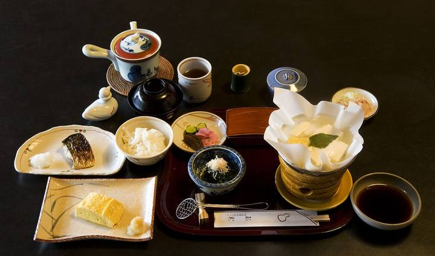
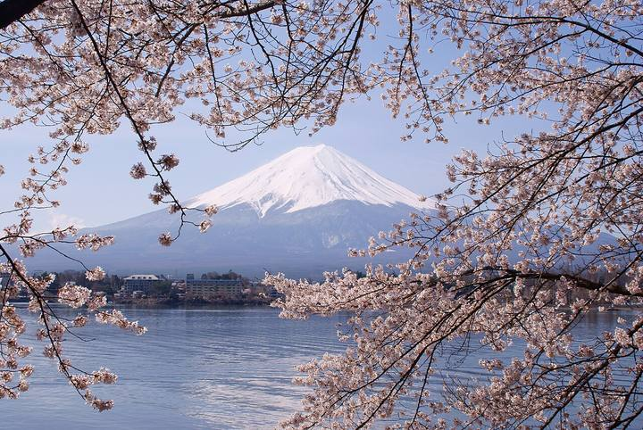

<nav class="crumb"><a href="/">子連れ宿ナビ</a> › <a href="/areas/山梨県/">山梨県</a> › <a href="/cities/富士河口湖町/">富士河口湖町</a></nav>
<header class="hero">
<figure class="ph"><picture><source media="(max-width:739px)" srcset="https://img.travel.rakuten.co.jp/HIMG/300/2946.jpg"></picture><figcaption class="credit">画像: 楽天トラベル</figcaption></figure>
<a href="https://hb.afl.rakuten.co.jp/hgc/52ba661c.11c9d9e2.52ba661d.9fa5c02a/?pc=https%3A%2F%2Fimg.travel.rakuten.co.jp%2Fimage%2Ftr%2Fapi%2Fif%2FuPw0Q%2F%3Ff_no%3D2946" target="_blank" rel="nofollow sponsored">この宿の空室・料金を見る（楽天トラベルで見る）</a>

<h1>富士河口湖温泉　富士山の見える温泉旅館　大池ホテル｜富士河口湖町の子連れにやさしい宿</h1>

山梨県南都留郡富士河口湖町船津6713-103 ・ 1泊 13,000円〜

★4.35 （楽天トラベル 口コミ5583件）

</header>

山梨 富士山 河口湖 露天風呂 温泉 バイキング ブッフェ 温泉　貸切露天風呂

富士河口湖温泉　富士山の見える温泉旅館　大池ホテルは、富士河口湖町にある総合★4.35（楽天トラベルの口コミ5583件）の宿です。子連れ・赤ちゃん連れのご家族からは、「子供が遊べる施設が充実」・「子供が騒いでも大丈夫」といった点が口コミで支持されています。このページでは、楽天トラベルの口コミから子連れ目線のポイントをまとめました（1泊 13,000円〜）。

◎ お世話

ベビー用品・お世話しやすい設備

○ 安全・添い寝

添い寝・小さな子も安心の部屋

◎ 食事・アレルギー

離乳食・アレルギー・部屋食など

<h2>口コミでわかる、子連れにおすすめな理由</h2>

食事「食事の時に、子どもに気を使っておしぼりを多めにくださったり、子ども用の食器をサッと渡してくださる気遣いに感激しました」

接客「子連れのため子ども達によるアクシデントが多々ありましたが嫌な顔せず対応してくださって感謝でいっぱいです」

子連れ歓迎「孫が、うれしい、楽しいを連発してくれたのでこちらもある程度奮発してよかったと思いました」

遊び「ウェルカムドリンクやドーナツやクッキーがとても嬉しく、子どもも喜んでいました」

お風呂「ウェルカムスイーツのドーナツやキッズスペース、お風呂上がりのアイスキャンディなど、とにかく子供が大喜びでこちらも嬉しく感じました」

お部屋「朝ごはんの話になり、子供も小さいので個室を使ってもいいですよと提案してくださり、それもまた感激でした」

— 楽天トラベルの口コミより（実際に泊まったご家族の声）

<h2>この宿、子供にうれしい</h2>

子供が遊べる施設が充実

遊び場やアクティビティで、子供を退屈させない

スタッフが子供に優しい

子供にも気さくに接してくれる、あたたかい宿

<h2>パパママにうれしい</h2>

子供が騒いでも大丈夫

多少さわいでも、気兼ねなく過ごせる雰囲気

子供も安心して眠れる

低いベッドや布団で、添い寝もしやすい

この宿の「子連れにいい」の根拠（口コミ・公式情報）
<ul><li>口コミ子連れでもキッズスペースでたのしく過ごせてありがたかったです</li><li>口コミ中でも子どもに手を振り、話しかけてくれ、小さい子ウェルカムな雰囲気が非常にありがたかったです</li><li>口コミ子供が小さいのでどうしてもうろちょろしたり、騒いだりしてしまうので</li><li>口コミ4人までの部屋ですが、幼児の孫を食事ありの布団なし添い寝だと5人でも泊まれます</li></ul>

<h2>お部屋</h2><figure class="ph"><figcaption class="credit">画像: 楽天トラベル</figcaption></figure>
<a href="https://hb.afl.rakuten.co.jp/hgc/52ba661c.11c9d9e2.52ba661d.9fa5c02a/?pc=https%3A%2F%2Fimg.travel.rakuten.co.jp%2Fimage%2Ftr%2Fapi%2Fif%2FuPw0Q%2F%3Ff_no%3D2946" target="_blank" rel="nofollow sponsored">客室つきプランを見る（楽天トラベルで見る）</a>

<h2>子連れにうれしい設備</h2>
湯沸かしポット加湿器(一部)

<h2>お食事</h2><figure class="ph"><figcaption class="credit">※写真はイメージです</figcaption></figure>
夕食は個室・レストランで。食事の口コミ評価は★4.45

<h2>お風呂</h2><figure class="ph"><figcaption class="credit">※写真はイメージです</figcaption></figure>
大浴場・露天風呂・家族風呂・天然温泉など。お風呂の口コミ評価は★4.31

<h2>子連れ目線の評価</h2>

食事4.45

お風呂4.31

客室4.23

接客4.5

立地4.4

設備4.29

<h2>泊まった人の声</h2><blockquote class="rev">「孫が、うれしい、楽しいを連発してくれたのでこちらもある程度奮発してよかったと思いました」<cite>— 楽天トラベルの口コミより</cite></blockquote>

<h2>ほかにも、こんな口コミがありました</h2><ul class="voices"><li>遊び「またキッズルームも快適で、これがあるだけで子供達がとても楽しそうにしていたので本当に助かりました」</li><li>接客「接客していただいた外国人の女性がとても丁寧で温かく、また他のスタッフの方もうちの子供に優しく接してもらえてこの宿にして良かったなぁと思いました」</li><li>遊び「ウェルカムフード、ドリンクも美味しく子供たちはドーナツを喜んで3つも食べていました」</li><li>お部屋「広いキッズルームもあって、子どもはずっと笑顔でよちよち歩いたりハイハイひてました」</li><li>食事「食事は夕食で懐石でしたがボリュームがあり、子供へはご飯をサービスしてくれたりと、満足です」</li><li>食事「ご飯も個室タイプだったので子連れには助かりました」</li></ul>
— いずれも楽天トラベルに寄せられた、実際に泊まったご家族の声です。

<h2>よくある質問</h2>

赤ちゃん・子供の食事はどうなりますか？

富士河口湖温泉　富士山の見える温泉旅館　大池ホテルの夕食は個室・レストランでいただけます。食事の口コミ評価は★4.45です。口コミには「食事の時に、子どもに気を使っておしぼりを多めにくださったり、子ども用の食器をサッと渡してくださる気遣いに感激しました」といった声もありました。離乳食やアレルギー対応は宿により異なるため、予約時にご確認ください。

子連れでもお風呂に入りやすいですか？

富士河口湖温泉　富士山の見える温泉旅館　大池ホテルには大浴場・露天風呂・家族風呂などがあります。貸切・家族風呂があれば、まわりを気にせず子供と入れます。

富士河口湖温泉　富士山の見える温泉旅館　大池ホテルは子連れ・赤ちゃん連れにおすすめですか？

富士河口湖町にある富士河口湖温泉　富士山の見える温泉旅館　大池ホテルは、楽天トラベルの口コミ5583件で総合★4.35。本ページでは、その口コミから子連れ目線で評価の高かったポイントをまとめています。

<h2>このエリアの雰囲気</h2><figure class="ph"><figcaption class="credit">※写真はイメージです</figcaption></figure>

★4.35・口コミ5583件のこの宿、空いてる日をチェック

<a class="btn" href="https://hb.afl.rakuten.co.jp/hgc/52ba661c.11c9d9e2.52ba661d.9fa5c02a/?pc=https%3A%2F%2Fimg.travel.rakuten.co.jp%2Fimage%2Ftr%2Fapi%2Fif%2FuPw0Q%2F%3Ff_no%3D2946" target="_blank" rel="nofollow sponsored">
空室・料金を楽天トラベルで見る →</a>
<a href="https://hb.afl.rakuten.co.jp/hgc/52ba661c.11c9d9e2.52ba661d.9fa5c02a/?pc=https%3A%2F%2Fimg.travel.rakuten.co.jp%2Fimage%2Ftr%2Fapi%2Fif%2FuPw0Q%2F%3Ff_no%3D2946" target="_blank" rel="nofollow sponsored">料金・割引クーポンも見る →</a>

※当サイトは楽天トラベルのアフィリエイトプログラムを利用しています。

#子連れ旅行 #子連れ温泉 #子連れ宿 #家族旅行 #赤ちゃん連れ旅行 #子連れ旅 #温泉旅行 #子連れお出かけ #ファミリー旅行 #子連れ宿ナビ #富士山

<footer class="credits"><h3>イメージ写真クレジット</h3><ul><li>Breakfast at Tamahan Ryokan, Kyoto.jpg by MichaelMaggs / CC BY-SA 3.0（<a href="https://upload.wikimedia.org/wikipedia/commons/thumb/f/f7/Breakfast_at_Tamahan_Ryokan%2C_Kyoto.jpg/1280px-Breakfast_at_Tamahan_Ryokan%2C_Kyoto.jpg" rel="nofollow">出典</a>）</li><li>Bokido of Hotel Urashima01o4592.jpg by 663highland / CC BY 2.5（<a href="https://upload.wikimedia.org/wikipedia/commons/thumb/a/a2/Bokido_of_Hotel_Urashima01o4592.jpg/1280px-Bokido_of_Hotel_Urashima01o4592.jpg" rel="nofollow">出典</a>）</li><li>Lake Kawaguchiko Sakura Mount Fuji 1.JPG by Midori / CC BY 3.0（<a href="https://upload.wikimedia.org/wikipedia/commons/thumb/d/df/Lake_Kawaguchiko_Sakura_Mount_Fuji_1.JPG/1280px-Lake_Kawaguchiko_Sakura_Mount_Fuji_1.JPG" rel="nofollow">出典</a>）</li></ul></footer>
