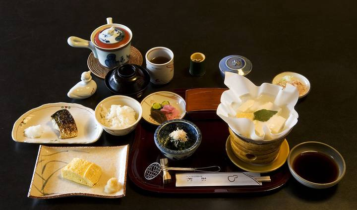

<nav class="crumb"><a href="/">子連れ宿ナビ</a> › <a href="/areas/岐阜県/">岐阜県</a> › <a href="/cities/東白川村/">東白川村</a></nav>
<header class="hero">
<figure class="ph"><picture><source media="(max-width:739px)" srcset="https://img.travel.rakuten.co.jp/HIMG/300/30142.jpg"></picture><figcaption class="credit">画像: 楽天トラベル</figcaption></figure>
<a href="https://hb.afl.rakuten.co.jp/hgc/52ba661c.11c9d9e2.52ba661d.9fa5c02a/?pc=https%3A%2F%2Fimg.travel.rakuten.co.jp%2Fimage%2Ftr%2Fapi%2Fif%2FuPw0Q%2F%3Ff_no%3D30142" target="_blank" rel="nofollow sponsored">この宿の空室・料金を見る（楽天トラベルで見る）</a>

<h1>料理旅館　吉村屋｜東白川村の子連れにやさしい宿</h1>

岐阜県加茂郡東白川村神土570 ・ 1泊 6,600円〜

★4.63 （楽天トラベル 口コミ474件）

</header>

お食事は個室を、檜風呂は貸切でご利用頂けます。静かにゆったりした週末をどうぞ。5組限定の宿です。

料理旅館　吉村屋は、東白川村にある総合★4.63（楽天トラベルの口コミ474件）の宿です。子連れ・赤ちゃん連れのご家族からは、「スタッフが子供に優しい」・「子供が騒いでも大丈夫」といった点が口コミで支持されています。このページでは、楽天トラベルの口コミから子連れ目線のポイントをまとめました（1泊 6,600円〜）。

◎ お世話

ベビー用品・お世話しやすい設備

◎ 安全・添い寝

添い寝・小さな子も安心の部屋

◎ 食事・アレルギー

離乳食・アレルギー・部屋食など

<h2>口コミでわかる、子連れにおすすめな理由</h2>

接客「9ヶ月の子供も一緒でしたが、夜中のmilkのことや、出発のお湯など、きちんと対応してくださって良心が行き届いてるなと思いました」

食事「・ごはんの部屋にテレビがついており子供も楽しそうにみていたのでゆっくりご飯が食べられて助かった」

お部屋「何より個室で食べれるので、小さな子連れでも気兼ねなく、ゆっくり食べれました」

お風呂「お部屋は広く、子ども向けのサービス、檜の貸切風呂など、どれも満足です」

設備「夏の暑い日でしたが、宿に着いたら冷たい麦茶をご用意いただいていて、子どもは美味しそうに何杯もおかわりしていました」

遊び「こたつも子ども達が喜んでました」

— 楽天トラベルの口コミより（実際に泊まったご家族の声）

<h2>この宿、子供にうれしい</h2>

スタッフが子供に優しい

子供にも気さくに接してくれる、あたたかい宿

子供のごはんも本格的

子供用の食事まで手を抜かない献立

<h2>パパママにうれしい</h2>

子供が騒いでも大丈夫

多少さわいでも、気兼ねなく過ごせる雰囲気

お部屋・個室で部屋食

人目を気にせず、子供を見ながらゆっくり食べられる

この宿の「子連れにいい」の根拠（口コミ・公式情報）
<ul><li>口コミ子供に優しく接していただいて、とても楽しい旅行になりました</li><li>口コミただ子供用のお子様ランチは少し改善の余地があると感じました</li><li>口コミ個室で食事が出来、周りを気にせず赤ちゃんと</li><li>口コミ個室で食事が出来、周りを気にせず赤ちゃんと</li></ul>

<h2>お部屋</h2><figure class="ph"><figcaption class="credit">画像: 楽天トラベル</figcaption></figure>
<a href="https://hb.afl.rakuten.co.jp/hgc/52ba661c.11c9d9e2.52ba661d.9fa5c02a/?pc=https%3A%2F%2Fimg.travel.rakuten.co.jp%2Fimage%2Ftr%2Fapi%2Fif%2FuPw0Q%2F%3Ff_no%3D30142" target="_blank" rel="nofollow sponsored">客室つきプランを見る（楽天トラベルで見る）</a>

<h2>子連れにうれしい設備</h2>
湯沸かしポット加湿器(一部)加湿機能付空気清浄機完備

<h2>お食事</h2><figure class="ph"><figcaption class="credit">※写真はイメージです</figcaption></figure>
夕食はお部屋（部屋食）・個室で。食事の口コミ評価は★4.71

<h2>お風呂</h2><figure class="ph"><figcaption class="credit">※写真はイメージです</figcaption></figure>
露天風呂・家族風呂など。お風呂の口コミ評価は★4.41

<h2>子連れ目線の評価</h2>

食事4.71

お風呂4.41

客室4.41

接客4.59

立地4.25

設備4.12

<h2>泊まった人の声</h2><blockquote class="rev">「お風呂も家族で入れて良かったですし、中居さんも子供達に優しくして下さり料理も美味しい」<cite>— 楽天トラベルの口コミより</cite></blockquote>

<h2>ほかにも、こんな口コミがありました</h2><ul class="voices"><li>接客「子供に優しく接していただいて、とても楽しい旅行になりました」</li><li>お風呂「お風呂は貸切で、ベビー用のリクライニングチェアの様なものもあったのでよかったです」</li><li>お部屋「部屋は離れだったので子供達が騒いでも大丈夫でしたし、騒いでも大丈夫ですよ、と声かけして頂いて安心しました」</li><li>お風呂「料理を美味しく頂け、又、娘から、ずっとお願いされていた家族風呂も叶えれて、又、宿のお孫さんとも親しくさせて頂き満足しています」</li><li>お部屋「部屋のコタツも暖かく、また懐かしく、子供たちも喜んでいました」</li><li>子連れ歓迎「お肉も中学の子供は期待していたのですが、それ以上に山菜がこれほどおいしいのか、と思うぐらいの天ぷらもあり、妻と私は大満足でした」</li></ul>
— いずれも楽天トラベルに寄せられた、実際に泊まったご家族の声です。

<h2>よくある質問</h2>

赤ちゃん・子供の食事はどうなりますか？

料理旅館　吉村屋の夕食はお部屋（部屋食）・個室でいただけます。食事の口コミ評価は★4.71です。口コミには「子供が小さいため、美味しいご飯を食べてお風呂に入ってゆっくりすることを目的に伺いました」といった声もありました。離乳食やアレルギー対応は宿により異なるため、予約時にご確認ください。

子連れでもお風呂に入りやすいですか？

料理旅館　吉村屋には露天風呂・家族風呂などがあります。貸切・家族風呂があれば、まわりを気にせず子供と入れます。

料理旅館　吉村屋は子連れ・赤ちゃん連れにおすすめですか？

東白川村にある料理旅館　吉村屋は、楽天トラベルの口コミ474件で総合★4.63。本ページでは、その口コミから子連れ目線で評価の高かったポイントをまとめています。

<h2>このエリアの雰囲気</h2><figure class="ph"><figcaption class="credit">※写真はイメージです</figcaption></figure>

★4.63・口コミ474件のこの宿、空いてる日をチェック

<a class="btn" href="https://hb.afl.rakuten.co.jp/hgc/52ba661c.11c9d9e2.52ba661d.9fa5c02a/?pc=https%3A%2F%2Fimg.travel.rakuten.co.jp%2Fimage%2Ftr%2Fapi%2Fif%2FuPw0Q%2F%3Ff_no%3D30142" target="_blank" rel="nofollow sponsored">
空室・料金を楽天トラベルで見る →</a>
<a href="https://hb.afl.rakuten.co.jp/hgc/52ba661c.11c9d9e2.52ba661d.9fa5c02a/?pc=https%3A%2F%2Fimg.travel.rakuten.co.jp%2Fimage%2Ftr%2Fapi%2Fif%2FuPw0Q%2F%3Ff_no%3D30142" target="_blank" rel="nofollow sponsored">料金・割引クーポンも見る →</a>

※当サイトは楽天トラベルのアフィリエイトプログラムを利用しています。

#子連れ旅行 #子連れ温泉 #子連れ宿 #家族旅行 #赤ちゃん連れ旅行 #子連れ旅 #温泉旅行 #子連れお出かけ #ファミリー旅行 #子連れ宿ナビ

<footer class="credits"><h3>イメージ写真クレジット</h3><ul><li>Breakfast at Tamahan Ryokan, Kyoto.jpg by MichaelMaggs / CC BY-SA 3.0（<a href="https://upload.wikimedia.org/wikipedia/commons/thumb/f/f7/Breakfast_at_Tamahan_Ryokan%2C_Kyoto.jpg/1280px-Breakfast_at_Tamahan_Ryokan%2C_Kyoto.jpg" rel="nofollow">出典</a>）</li><li>Bokido of Hotel Urashima01o4592.jpg by 663highland / CC BY 2.5（<a href="https://upload.wikimedia.org/wikipedia/commons/thumb/a/a2/Bokido_of_Hotel_Urashima01o4592.jpg/1280px-Bokido_of_Hotel_Urashima01o4592.jpg" rel="nofollow">出典</a>）</li><li>Beech forest in Nyuto Onsenkyo (1).jpg by 掬茶 / CC BY-SA 4.0（<a href="wikimedia" rel="nofollow">出典</a>）</li></ul></footer>
