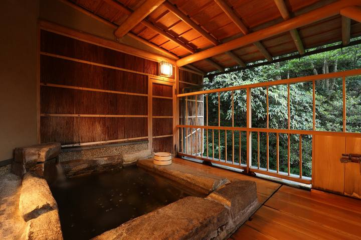

<nav class="crumb"><a href="/">子連れ宿ナビ</a> › <a href="/areas/新潟県/">新潟県</a> › <a href="/cities/新潟市/">新潟市</a></nav>
<header class="hero">
<figure class="ph"><picture><source media="(max-width:739px)" srcset="https://img.travel.rakuten.co.jp/HIMG/300/38824.jpg"></picture><figcaption class="credit">画像: 楽天トラベル</figcaption></figure>
<a href="https://hb.afl.rakuten.co.jp/hgc/52ba661c.11c9d9e2.52ba661d.9fa5c02a/?pc=https%3A%2F%2Fimg.travel.rakuten.co.jp%2Fimage%2Ftr%2Fapi%2Fif%2FuPw0Q%2F%3Ff_no%3D38824" target="_blank" rel="nofollow sponsored">この宿の空室・料金を見る（楽天トラベルで見る）</a>

<h1>新潟　岩室温泉　自家源泉の宿　富士屋｜新潟市の子連れにやさしい宿</h1>

新潟県新潟市西蒲区岩室温泉693 ・ 1泊 10,752円〜

★4.46 （楽天トラベル 口コミ743件）

</header>

2012年自家源泉で開湯!!　地元野菜と新潟山海の幸が自慢の老舗旅館

新潟　岩室温泉　自家源泉の宿　富士屋は、新潟市にある総合★4.46（楽天トラベルの口コミ743件）の宿です。子連れ・赤ちゃん連れのご家族からは、「赤ちゃんグッズが充実」・「客室にお風呂付き」といった点が口コミで支持されています。このページでは、楽天トラベルの口コミから子連れ目線のポイントをまとめました（1泊 10,752円〜）。

◎ お世話

ベビー用品・お世話しやすい設備

○ 安全・添い寝

添い寝・小さな子も安心の部屋

○ 食事・アレルギー

離乳食・アレルギー・部屋食など

<h2>口コミでわかる、子連れにおすすめな理由</h2>

食事「子連れだったためか、夕食は個室で用意してくれて、ゆっくり食事できました」

設備「赤ちゃんグッズの貸し出しもしてくれて助かりました」

接客「１歳の子連れ旅行でしたが、到着時から丁寧な対応で接して頂きました」

お風呂「ベビーバスや遊べるスペースもあって、小さなお子さんがいても安心して過ごせるお宿ですね」

子連れ歓迎「今回のプランでは赤ちゃん用の備品の取り揃えもしっかりしていて安心できました」

遊び「キッズルームは大人もゆっくりできるスペースで子どもも楽しめました」

— 楽天トラベルの口コミより（実際に泊まったご家族の声）

<h2>この宿、子供にうれしい</h2>

赤ちゃんグッズが充実

バンボやベビーバスまであって、赤ちゃん連れも手ぶらでOK

子供が遊べる施設が充実

遊び場やアクティビティで、子供を退屈させない

<h2>パパママにうれしい</h2>

客室にお風呂付き

子供を連れて大浴場まで歩かなくてOK

貸切・家族風呂

人目を気にせず、子供と一緒にゆっくり入れる

この宿の「子連れにいい」の根拠（口コミ・公式情報）
<ul><li>口コミお風呂も家族風呂でベビーバスに温泉をホースからのお湯で薄めて入ることができました</li><li>口コミ1階に子供の遊び場もあって、どら焼きコーナーもあって楽しめました</li><li>口コミ食事は、のどぐろ1匹で大きさ、うまさに妻は大喜び、にいがた和牛は、やらかさ、おいしさ子供たちが大喜び部屋風呂も子供が真っ先に入り、大喜びしていました</li><li>口コミ貸切風呂は子供も大喜びでした</li></ul>

<h2>お部屋</h2><figure class="ph"><figcaption class="credit">画像: 楽天トラベル</figcaption></figure>
<a href="https://hb.afl.rakuten.co.jp/hgc/52ba661c.11c9d9e2.52ba661d.9fa5c02a/?pc=https%3A%2F%2Fimg.travel.rakuten.co.jp%2Fimage%2Ftr%2Fapi%2Fif%2FuPw0Q%2F%3Ff_no%3D38824" target="_blank" rel="nofollow sponsored">客室つきプランを見る（楽天トラベルで見る）</a>

<h2>子連れにうれしい設備</h2>
湯沸かしポット加湿器(貸出)

<h2>お食事</h2><figure class="ph"><figcaption class="credit">※写真はイメージです</figcaption></figure>
夕食はレストラン・食事処で。食事の口コミ評価は★4.59

<h2>お風呂</h2><figure class="ph"><figcaption class="credit">※写真はイメージです</figcaption></figure>
大浴場・露天風呂・家族風呂・天然温泉など。お風呂の口コミ評価は★4.57

<h2>子連れ目線の評価</h2>

食事4.59

お風呂4.57

客室4.36

接客4.54

立地4.21

設備4.34

<h2>泊まった人の声</h2><blockquote class="rev">「朝食もビュッフェスタイルで野菜中心でしたが美味しく頂き、普段あまり食べない子供達も、喜んで完食していました」<cite>— 楽天トラベルの口コミより</cite></blockquote>

<h2>ほかにも、こんな口コミがありました</h2><ul class="voices"><li>子連れ歓迎「子供は特に蚊に刺されると化膿してしまうことがあるので、対策いただけると、より快適に安心して利用できると思います」</li><li>設備「赤ちゃんデビュープランでの利用で、様々な物品をお借りすることが出来たので、とても助かりました」</li><li>設備「接客して頂いた男性も赤ちゃん用の布団を用意頂きとても助かりました」</li><li>遊び「帰り際、女将の手作りと書かれていたので女将さん？と思われる方ににそれでもと思い『赤ちゃん懐石喜んで食べました」</li><li>食事「夕食は個室で別料金でお子様ランチを頼みましたがボリュームがあり美味しかったようです」</li><li>子連れ歓迎「お料理も良かったのですが、出てくる間が長く孫が飽きてしまいました💦」</li></ul>
— いずれも楽天トラベルに寄せられた、実際に泊まったご家族の声です。

<h2>よくある質問</h2>

赤ちゃん・子供の食事はどうなりますか？

新潟　岩室温泉　自家源泉の宿　富士屋の夕食はレストラン・食事処でいただけます。食事の口コミ評価は★4.59です。口コミには「夕食は個室で別料金でお子様ランチを頼みましたがボリュームがあり美味しかったようです」といった声もありました。離乳食やアレルギー対応は宿により異なるため、予約時にご確認ください。

子連れでもお風呂に入りやすいですか？

新潟　岩室温泉　自家源泉の宿　富士屋には大浴場・露天風呂・家族風呂などがあります。貸切・家族風呂があれば、まわりを気にせず子供と入れます。

新潟　岩室温泉　自家源泉の宿　富士屋は子連れ・赤ちゃん連れにおすすめですか？

新潟市にある新潟　岩室温泉　自家源泉の宿　富士屋は、楽天トラベルの口コミ743件で総合★4.46。本ページでは、その口コミから子連れ目線で評価の高かったポイントをまとめています。

<h2>このエリアの雰囲気</h2><figure class="ph"><figcaption class="credit">※写真はイメージです</figcaption></figure>

★4.46・口コミ743件のこの宿、空いてる日をチェック

<a class="btn" href="https://hb.afl.rakuten.co.jp/hgc/52ba661c.11c9d9e2.52ba661d.9fa5c02a/?pc=https%3A%2F%2Fimg.travel.rakuten.co.jp%2Fimage%2Ftr%2Fapi%2Fif%2FuPw0Q%2F%3Ff_no%3D38824" target="_blank" rel="nofollow sponsored">
空室・料金を楽天トラベルで見る →</a>
<a href="https://hb.afl.rakuten.co.jp/hgc/52ba661c.11c9d9e2.52ba661d.9fa5c02a/?pc=https%3A%2F%2Fimg.travel.rakuten.co.jp%2Fimage%2Ftr%2Fapi%2Fif%2FuPw0Q%2F%3Ff_no%3D38824" target="_blank" rel="nofollow sponsored">料金・割引クーポンも見る →</a>

※当サイトは楽天トラベルのアフィリエイトプログラムを利用しています。

#子連れ旅行 #子連れ温泉 #子連れ宿 #家族旅行 #赤ちゃん連れ旅行 #子連れ旅 #温泉旅行 #子連れお出かけ #ファミリー旅行 #子連れ宿ナビ #新潟旅行

<footer class="credits"><h3>イメージ写真クレジット</h3><ul><li>AEON-Mall-Makuhari-Shintoshin 11 2021-11.jpg by RuinDig/Yuki Uchida / CC BY 4.0（<a href="https://upload.wikimedia.org/wikipedia/commons/thumb/d/d6/AEON-Mall-Makuhari-Shintoshin_11_2021-11.jpg/1280px-AEON-Mall-Makuhari-Shintoshin_11_2021-11.jpg" rel="nofollow">出典</a>）</li><li>Bokido of Hotel Urashima01o4592.jpg by 663highland / CC BY 2.5（<a href="https://upload.wikimedia.org/wikipedia/commons/thumb/a/a2/Bokido_of_Hotel_Urashima01o4592.jpg/1280px-Bokido_of_Hotel_Urashima01o4592.jpg" rel="nofollow">出典</a>）</li><li>Lake Kawaguchiko Sakura Mount Fuji 1.JPG by Midori / CC BY 3.0（<a href="https://upload.wikimedia.org/wikipedia/commons/thumb/d/df/Lake_Kawaguchiko_Sakura_Mount_Fuji_1.JPG/1280px-Lake_Kawaguchiko_Sakura_Mount_Fuji_1.JPG" rel="nofollow">出典</a>）</li></ul></footer>
