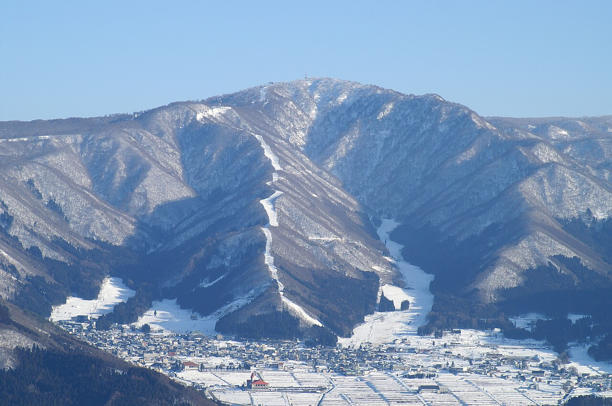

<nav class="crumb"><a href="/">子連れ宿ナビ</a> › <a href="/areas/新潟県/">新潟県</a> › <a href="/cities/津南町/">津南町</a></nav>
<header class="hero">
<figure class="ph"><picture><source media="(max-width:739px)" srcset="https://img.travel.rakuten.co.jp/HIMG/300/39716.jpg"></picture><figcaption class="credit">画像: 楽天トラベル</figcaption></figure>
<a href="https://hb.afl.rakuten.co.jp/hgc/52ba661c.11c9d9e2.52ba661d.9fa5c02a/?pc=https%3A%2F%2Fimg.travel.rakuten.co.jp%2Fimage%2Ftr%2Fapi%2Fif%2FuPw0Q%2F%3Ff_no%3D39716" target="_blank" rel="nofollow sponsored">この宿の空室・料金を見る（楽天トラベルで見る）</a>

<h1>津南駅前温泉　花とほたる　湯のさと　雪国｜津南町の子連れにやさしい宿</h1>

新潟県中魚沼郡津南町外丸丁2274 ・ 1泊 11,000円〜

★4.68 （楽天トラベル 口コミ334件）

</header>

悠然と流れる信濃川のほとりに佇む和風旅館、雪国には手作りがいっぱい

津南駅前温泉　花とほたる　湯のさと　雪国は、津南町にある総合★4.68（楽天トラベルの口コミ334件）の宿です。子連れ・赤ちゃん連れのご家族からは、「焚き火や花火で大はしゃぎ」・「貸切・家族風呂」といった点が口コミで支持されています。このページでは、楽天トラベルの口コミから子連れ目線のポイントをまとめました（1泊 11,000円〜）。

○ お世話

ベビー用品・お世話しやすい設備

○ 安全・添い寝

添い寝・小さな子も安心の部屋

○ 食事・アレルギー

離乳食・アレルギー・部屋食など

<h2>口コミでわかる、子連れにおすすめな理由</h2>

食事「食事をする所にも赤ちゃん用のチェアを用意してくださり、お風呂場にもオムツ台等がありました」

接客「小さい子ども連れだったのですが、若奥様が優しく遊んでくれて、近くのおすすめスポットと教えてくれたりと、久しぶりの旅行をとても楽しむことができました✨」

子連れ歓迎「孫のお子様ランチもとても優しい味で感動しました」

お風呂「貸切風呂は子連れにはありがたかったのですが、脱衣所が周辺民家から丸見えです」

食事「1歳半の子供を連れて初めての旅行でしたが、食事も個室に用意していただけたのでとても助かりました」

食事「ご飯もとても美味しく、子供の卵アレルギーにもご配慮くださり、本当に助かりました」

— 楽天トラベルの口コミより（実際に泊まったご家族の声）

<h2>この宿、子供にうれしい</h2>

焚き火や花火で大はしゃぎ

外遊びや花火で、子供がとびきりの笑顔に

子供のごはんも本格的

子供用の食事まで手を抜かない献立

<h2>パパママにうれしい</h2>

貸切・家族風呂

人目を気にせず、子供と一緒にゆっくり入れる

お部屋・個室で部屋食

人目を気にせず、子供を見ながらゆっくり食べられる

この宿の「子連れにいい」の根拠（口コミ・公式情報）
<ul><li>口コミ帰りには子供に花火をプレゼントして頂きました</li><li>口コミ孫のお子様ランチもとても優しい味で感動しました</li><li>口コミ貸切風呂は子連れにはありがたかったのですが、脱衣所が周辺民家から丸見えです</li><li>公式公式: 夕食/朝食=部屋・個室（部屋食）</li></ul>

<h2>お部屋</h2><figure class="ph"><figcaption class="credit">画像: 楽天トラベル</figcaption></figure>
<a href="https://hb.afl.rakuten.co.jp/hgc/52ba661c.11c9d9e2.52ba661d.9fa5c02a/?pc=https%3A%2F%2Fimg.travel.rakuten.co.jp%2Fimage%2Ftr%2Fapi%2Fif%2FuPw0Q%2F%3Ff_no%3D39716" target="_blank" rel="nofollow sponsored">客室つきプランを見る（楽天トラベルで見る）</a>

<h2>お食事</h2><figure class="ph"><figcaption class="credit">※写真はイメージです</figcaption></figure>
夕食は個室・食事処で。食事の口コミ評価は★4.69

<h2>お風呂</h2><figure class="ph"><figcaption class="credit">※写真はイメージです</figcaption></figure>
大浴場・露天風呂・天然温泉など。お風呂の口コミ評価は★4.58

<h2>子連れ目線の評価</h2>

食事4.69

お風呂4.58

客室4.51

接客4.73

立地4.35

設備4.52

<h2>泊まった人の声</h2><blockquote class="rev">「ご飯もとても美味しく、子供の卵アレルギーにもご配慮くださり、本当に助かりました」<cite>— 楽天トラベルの口コミより</cite></blockquote>

<h2>ほかにも、こんな口コミがありました</h2><ul class="voices"><li>子連れ歓迎「子供のためにソリ滑りできるように坂を作ってくれたり、豪雪の状況も逐一教えてくれて大変助かりました」</li><li>食事「うちは、2歳の子供が行ったので、食事の時に子供用椅子があったら助かりました」</li><li>子連れ歓迎「子供の話など沢山できて、とても楽しかったです」</li><li>遊び「帰りには子供に花火をプレゼントして頂きました」</li><li>食事「ウインナー、ヨーグルトなどの簡単なものでいいので用意していただけたら、小さい子どもでももっと食事が楽しめたと思います」</li></ul>
— いずれも楽天トラベルに寄せられた、実際に泊まったご家族の声です。

<h2>よくある質問</h2>

赤ちゃん・子供の食事はどうなりますか？

津南駅前温泉　花とほたる　湯のさと　雪国の夕食は個室・食事処でいただけます。食事の口コミ評価は★4.69です。口コミには「ご飯もとても美味しく、子供の卵アレルギーにもご配慮くださり、本当に助かりました」といった声もありました。離乳食やアレルギー対応は宿により異なるため、予約時にご確認ください。

子連れでもお風呂に入りやすいですか？

津南駅前温泉　花とほたる　湯のさと　雪国には大浴場・露天風呂などがあります。貸切・家族風呂があれば、まわりを気にせず子供と入れます。

津南駅前温泉　花とほたる　湯のさと　雪国は子連れ・赤ちゃん連れにおすすめですか？

津南町にある津南駅前温泉　花とほたる　湯のさと　雪国は、楽天トラベルの口コミ334件で総合★4.68。本ページでは、その口コミから子連れ目線で評価の高かったポイントをまとめています。

<h2>このエリアの雰囲気</h2><figure class="ph"><figcaption class="credit">※写真はイメージです</figcaption></figure>

★4.68・口コミ334件のこの宿、空いてる日をチェック

<a class="btn" href="https://hb.afl.rakuten.co.jp/hgc/52ba661c.11c9d9e2.52ba661d.9fa5c02a/?pc=https%3A%2F%2Fimg.travel.rakuten.co.jp%2Fimage%2Ftr%2Fapi%2Fif%2FuPw0Q%2F%3Ff_no%3D39716" target="_blank" rel="nofollow sponsored">
空室・料金を楽天トラベルで見る →</a>
<a href="https://hb.afl.rakuten.co.jp/hgc/52ba661c.11c9d9e2.52ba661d.9fa5c02a/?pc=https%3A%2F%2Fimg.travel.rakuten.co.jp%2Fimage%2Ftr%2Fapi%2Fif%2FuPw0Q%2F%3Ff_no%3D39716" target="_blank" rel="nofollow sponsored">料金・割引クーポンも見る →</a>

※当サイトは楽天トラベルのアフィリエイトプログラムを利用しています。

#子連れ旅行 #子連れ温泉 #子連れ宿 #家族旅行 #赤ちゃん連れ旅行 #子連れ旅 #温泉旅行 #子連れお出かけ #ファミリー旅行 #子連れ宿ナビ

<footer class="credits"><h3>イメージ写真クレジット</h3><ul><li>Breakfast at Tamahan Ryokan, Kyoto.jpg by MichaelMaggs / CC BY-SA 3.0（<a href="https://upload.wikimedia.org/wikipedia/commons/thumb/f/f7/Breakfast_at_Tamahan_Ryokan%2C_Kyoto.jpg/1280px-Breakfast_at_Tamahan_Ryokan%2C_Kyoto.jpg" rel="nofollow">出典</a>）</li><li>Bokido of Hotel Urashima01o4592.jpg by 663highland / CC BY 2.5（<a href="https://upload.wikimedia.org/wikipedia/commons/thumb/a/a2/Bokido_of_Hotel_Urashima01o4592.jpg/1280px-Bokido_of_Hotel_Urashima01o4592.jpg" rel="nofollow">出典</a>）</li><li>Nozawa Onsen 01.jpg by Hideyuki KAMON / CC BY-SA 2.0（<a href="https://upload.wikimedia.org/wikipedia/commons/thumb/1/1d/Nozawa_Onsen_01.jpg/1280px-Nozawa_Onsen_01.jpg" rel="nofollow">出典</a>）</li></ul></footer>
