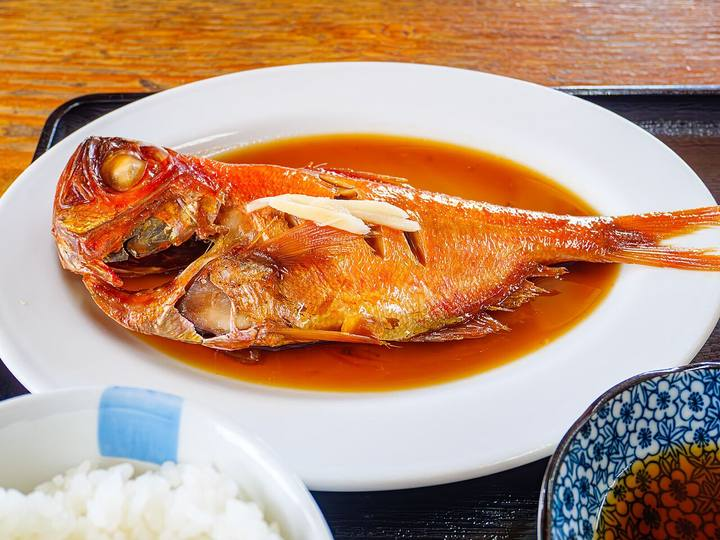

<nav class="crumb"><a href="/">子連れ宿ナビ</a> › <a href="/areas/静岡県/">静岡県</a> › 伊東市</nav>
<header class="hero">
<figure class="ph"><figcaption class="credit">画像: 楽天トラベル</figcaption></figure>
<a href="https://hb.afl.rakuten.co.jp/hgc/52ba661c.11c9d9e2.52ba661d.9fa5c02a/?pc=https%3A%2F%2Fimg.travel.rakuten.co.jp%2Fimage%2Ftr%2Fapi%2Fif%2FuPw0Q%2F%3Ff_no%3D40025" target="_blank" rel="nofollow sponsored">▶ この宿の空室・料金を見る（楽天トラベルで見る）</a>

<h1>絶景の癒しの湯宿　茄子のはな｜伊東市の子連れにやさしい宿</h1>

静岡県伊東市池635-135 ・ 1泊 7,150円〜

★4.59 （楽天トラベル 口コミ387件）

</header>

全室に海と伊豆七島を望む温泉露天風呂付の人気宿。伊豆三大味覚「伊勢海老・金目鯛・あしたか牛」は絶品！

絶景の癒しの湯宿　茄子のはなは、伊東市にある総合★4.59（楽天トラベルの口コミ387件）の宿です。子連れ・赤ちゃん連れのご家族からは、「ゆったりした客室」・「子供が騒いでも大丈夫」といった点が口コミで支持されています。このページでは、楽天トラベルの口コミから子連れ目線のポイントをまとめました（1泊 7,150円〜）。

🍼

◎ お世話

ベビー用品・お世話しやすい設備

🛡️

○ 安全・添い寝

添い寝・小さな子も安心の部屋

🍚

○ 食事・アレルギー

離乳食・アレルギー・部屋食など

<h2>口コミでわかる、子連れにおすすめな理由</h2>

食事「2.4歳の子連れで特にご飯の際は騒がしくご迷惑をかけてしまったと思いますが、優しく対応してくださったり、会うと声を掛けてくれたりととても嬉しかったです」

接客「子供にも優しく接してくださりありがとうございました」

食事「子ども用メニューがしっかり用意されており、大人も子どもも部屋食でゆっくり出来ました」

食事「幼児2人が一緒だったので、朝晩部屋食だったのが周りを気にせずゆっくり食べられてとても良かったです」

接客「毎年結婚記念日に来させて頂いておりますが、当初より孫様に対応して頂いているため、実家に帰ったような落ち着きがあります」

— 楽天トラベルの口コミより（実際に泊まったご家族の声）

<h2>この宿、子供にうれしい</h2>

👶 ゆったりした客室

お部屋が広くて、子供ものびのび過ごせる

<h2>パパママにうれしい</h2>

☺️ 子供が騒いでも大丈夫

多少さわいでも、気兼ねなく過ごせる雰囲気

☺️ お部屋・個室で部屋食

人目を気にせず、子供を見ながらゆっくり食べられる

この宿の「子連れにいい」の根拠（口コミ・公式情報）
<ul><li>公式総合★4.59（387件）</li><li>口コミ幼児2人が一緒だったので、朝晩部屋食だったのが周りを気にせずゆっくり食べられてとても良かったです</li><li>口コミ子ども用メニューがしっかり用意されており、大人も子どもも部屋食でゆっくり出来ました</li></ul>

<h2>お部屋</h2><figure class="ph"><figcaption class="credit">画像: 楽天トラベル</figcaption></figure>
<a href="https://hb.afl.rakuten.co.jp/hgc/52ba661c.11c9d9e2.52ba661d.9fa5c02a/?pc=https%3A%2F%2Fimg.travel.rakuten.co.jp%2Fimage%2Ftr%2Fapi%2Fif%2FuPw0Q%2F%3Ff_no%3D40025" target="_blank" rel="nofollow sponsored">▶ 客室つきプランを見る（楽天トラベルで見る）</a>

<h2>子連れにうれしい設備</h2>
湯沸かしポット加湿器

<h2>お食事</h2><figure class="ph"><figcaption class="credit">※写真はイメージです</figcaption></figure>
夕食は食事処で。食事の口コミ評価は★4.7

<h2>お風呂</h2><figure class="ph"><figcaption class="credit">※写真はイメージです</figcaption></figure>
露天風呂など。お風呂の口コミ評価は★4.59

<h2>子連れ目線の評価</h2>

食事4.7

お風呂4.59

客室4.45

接客4.58

立地4.5

設備4.38

<h2>泊まった人の声</h2><blockquote class="rev">「2.4歳の子連れで特にご飯の際は騒がしくご迷惑をかけてしまったと思いますが、優しく対応してくださったり、会うと声を掛けてくれたりととても嬉しかったです」<cite>— 楽天トラベルの口コミより</cite></blockquote>

<h2>ほかにも、こんな口コミがありました</h2><ul class="voices"><li>接客「赤ちゃんプランがあることに惹かれて予約したが、実際に行ってみるとスタッフ様及び施設の子どもへの配慮が素晴らしく生後4か月の子どもの旅行デビューに大変満足しました」</li><li>子連れ歓迎「お子様連れの方でも楽しめると思います」</li><li>子連れ歓迎「子連れには、過ごしやすい宿で良かったです」</li></ul>
— いずれも楽天トラベルに寄せられた、実際に泊まったご家族の声です。

<h2>よくある質問</h2>

赤ちゃん・子供の食事はどうなりますか？

絶景の癒しの湯宿　茄子のはなの夕食は食事処でいただけます。食事の口コミ評価は★4.7です。離乳食やアレルギー対応は宿により異なるため、予約時にご確認ください。

子連れでもお風呂に入りやすいですか？

絶景の癒しの湯宿　茄子のはなには露天風呂などがあります。貸切・家族風呂があれば、まわりを気にせず子供と入れます。

絶景の癒しの湯宿　茄子のはなは子連れ・赤ちゃん連れにおすすめですか？

伊東市にある絶景の癒しの湯宿　茄子のはなは、楽天トラベルの口コミ387件で総合★4.59。本ページでは、その口コミから子連れ目線で評価の高かったポイントをまとめています。

<h2>このエリアの雰囲気</h2><figure class="ph"><figcaption class="credit">※写真はイメージです</figcaption></figure>

★4.59・口コミ387件のこの宿、空いてる日をチェック

<a class="btn" href="https://hb.afl.rakuten.co.jp/hgc/52ba661c.11c9d9e2.52ba661d.9fa5c02a/?pc=https%3A%2F%2Fimg.travel.rakuten.co.jp%2Fimage%2Ftr%2Fapi%2Fif%2FuPw0Q%2F%3Ff_no%3D40025" target="_blank" rel="nofollow sponsored">
空室・料金を楽天トラベルで見る →</a>
<a href="https://hb.afl.rakuten.co.jp/hgc/52ba661c.11c9d9e2.52ba661d.9fa5c02a/?pc=https%3A%2F%2Fimg.travel.rakuten.co.jp%2Fimage%2Ftr%2Fapi%2Fif%2FuPw0Q%2F%3Ff_no%3D40025" target="_blank" rel="nofollow sponsored">料金・割引クーポンも見る →</a>

※当サイトは楽天トラベルのアフィリエイトプログラムを利用しています。

#子連れ旅行 #子連れ温泉 #子連れ宿 #家族旅行 #赤ちゃん連れ旅行 #子連れ旅 #温泉旅行 #子連れお出かけ #ファミリー旅行 #子連れ宿ナビ

<footer class="credits"><h3>イメージ写真クレジット</h3><ul><li>Bokido of Hotel Urashima01o4592.jpg by 663highland / CC BY 2.5（<a href="https://upload.wikimedia.org/wikipedia/commons/thumb/a/a2/Bokido_of_Hotel_Urashima01o4592.jpg/1280px-Bokido_of_Hotel_Urashima01o4592.jpg" rel="nofollow">出典</a>）</li><li>Izu peninsula UNESCO geopark 2022 Sept 12 various 18 34 43 702000.jpeg by Nesnad / CC BY 4.0（<a href="https://upload.wikimedia.org/wikipedia/commons/thumb/2/27/Izu_peninsula_UNESCO_geopark_2022_Sept_12_various_18_34_43_702000.jpeg/1280px-Izu_peninsula_UNESCO_geopark_2022_Sept_12_various_18_34_43_702000.jpeg" rel="nofollow">出典</a>）</li></ul></footer>
