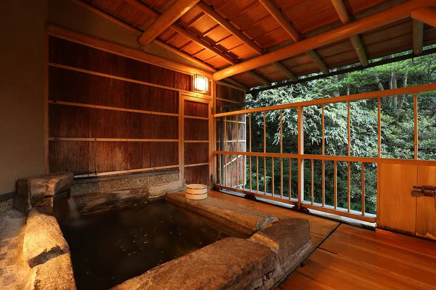

<nav class="crumb"><a href="/">子連れ宿ナビ</a> › <a href="/areas/千葉県/">千葉県</a> › <a href="/cities/鴨川市/">鴨川市</a></nav>
<header class="hero">
<figure class="ph"><picture><source media="(max-width:739px)" srcset="https://img.travel.rakuten.co.jp/HIMG/300/51733.jpg"></picture><figcaption class="credit">画像: 楽天トラベル</figcaption></figure>
<a href="https://hb.afl.rakuten.co.jp/hgc/52ba661c.11c9d9e2.52ba661d.9fa5c02a/?pc=https%3A%2F%2Fimg.travel.rakuten.co.jp%2Fimage%2Ftr%2Fapi%2Fif%2FuPw0Q%2F%3Ff_no%3D51733" target="_blank" rel="nofollow sponsored">この宿の空室・料金を見る（楽天トラベルで見る）</a>

<h1>鴨川館｜鴨川市の子連れにやさしい宿</h1>

千葉県鴨川市西町1179 ・ 1泊 12,650円〜

★4.62 （楽天トラベル 口コミ1434件）

</header>

2024年大浴場リニューアル&amp;インドアテラス客室誕生！人気の鴨川シーワールドまで徒歩3分

鴨川館は、鴨川市にある総合★4.62（楽天トラベルの口コミ1434件）の宿です。子連れ・赤ちゃん連れのご家族からは、「赤ちゃんグッズが充実」・「お部屋・個室で部屋食」といった点が口コミで支持されています。このページでは、楽天トラベルの口コミから子連れ目線のポイントをまとめました（1泊 12,650円〜）。

◎ お世話

ベビー用品・お世話しやすい設備

○ 安全・添い寝

添い寝・小さな子も安心の部屋

◎ 食事・アレルギー

離乳食・アレルギー・部屋食など

<h2>口コミでわかる、子連れにおすすめな理由</h2>

接客「スタッフの皆さんもとても優しく親切で、子ども達に声をかけてくれたり、チェックアウト後は建物の前で記念写真も撮ってくださったりしました」

遊び「すれ違うたびに笑顔で挨拶してくださったり、子供用に麦茶が売られていたり、本当にいい旅行になりました」

設備「ベビー連れには本当に有り難いです」

お風呂「お部屋には、バンボ、バウンサー、ベビーソープ、ベビーバス、おむつ袋の用意があり、売店でオムツ&amp;お尻拭きの引き換えをすることができました」

食事「好きなタイミングで食事ができるのは子連れにはとてもありがたかったです」

子連れ歓迎「赤ちゃん連れでも安心して泊まることが出来、最後には家族の写真も撮って頂き、とても良い思い出になりました」

— 楽天トラベルの口コミより（実際に泊まったご家族の声）

<h2>この宿、子供にうれしい</h2>

赤ちゃんグッズが充実

バンボやベビーバスまであって、赤ちゃん連れも手ぶらでOK

子供が遊べる施設が充実

遊び場やアクティビティで、子供を退屈させない

<h2>パパママにうれしい</h2>

お部屋・個室で部屋食

人目を気にせず、子供を見ながらゆっくり食べられる

貸切・家族風呂

人目を気にせず、子供と一緒にゆっくり入れる

この宿の「子連れにいい」の根拠（口コミ・公式情報）
<ul><li>口コミベビーバスやベビーソープ等もあり出産してからも小さい赤ちゃんを連れて来れそうな場所です</li><li>口コミお部屋も広く綺麗で、4階のキッズスペースも狭いながらおもちゃや絵本が置いてあって、滞在中子どもたちを安全に楽しく過ごさせるには十分でした</li><li>口コミ今回は小さな子どもがいるため部屋食プランを選びました</li><li>公式公式: 風呂種別に家族風呂あり</li></ul>

<h2>お部屋</h2><figure class="ph"><figcaption class="credit">画像: 楽天トラベル</figcaption></figure>
<a href="https://hb.afl.rakuten.co.jp/hgc/52ba661c.11c9d9e2.52ba661d.9fa5c02a/?pc=https%3A%2F%2Fimg.travel.rakuten.co.jp%2Fimage%2Ftr%2Fapi%2Fif%2FuPw0Q%2F%3Ff_no%3D51733" target="_blank" rel="nofollow sponsored">客室つきプランを見る（楽天トラベルで見る）</a>

<h2>子連れにうれしい設備</h2>
湯沸かしポット加湿器プール(夏期のみ)卓球

<h2>お食事</h2><figure class="ph"><figcaption class="credit">※写真はイメージです</figcaption></figure>
夕食はお部屋（部屋食）・個室で。食事の口コミ評価は★4.58

<h2>お風呂</h2><figure class="ph"><figcaption class="credit">※写真はイメージです</figcaption></figure>
大浴場・露天風呂・サウナ・家族風呂など。お風呂の口コミ評価は★4.62

<h2>子連れ目線の評価</h2>

食事4.58

お風呂4.62

客室4.64

接客4.59

立地4.6

設備4.6

<h2>泊まった人の声</h2><blockquote class="rev">「子供用にうどんや茶碗蒸しが部屋食で頼めたり、無料のご飯をいただけたりと、持参した離乳食をあまり使わないで済みました」<cite>— 楽天トラベルの口コミより</cite></blockquote>

<h2>ほかにも、こんな口コミがありました</h2><ul class="voices"><li>設備「アメニティや子供向けの設備も充実していて、鴨シーへのアクセスも最高で、また行きたいです」</li><li>子連れ歓迎「夕方子供が疲れて寝てしまったのですが、宿が道路を挟んですぐ側なのでとても助かりました」</li><li>子連れ歓迎「調乳用の給湯器も24時間使えたので、子どもがグズったときにもすぐにミルクが作れて大助かりでした」</li><li>接客「マタニティにも優しく、子連れにも優しくとても快適に、贅沢ができる旅館でした」</li><li>お風呂「ベビーバスやベビーソープ等もあり出産してからも小さい赤ちゃんを連れて来れそうな場所です」</li><li>食事「今回は小さな子どもがいるため部屋食プランを選びました」</li></ul>
— いずれも楽天トラベルに寄せられた、実際に泊まったご家族の声です。

<h2>よくある質問</h2>

赤ちゃん・子供の食事はどうなりますか？

鴨川館の夕食はお部屋（部屋食）・個室でいただけます。食事の口コミ評価は★4.58です。口コミには「子供用にうどんや茶碗蒸しが部屋食で頼めたり、無料のご飯をいただけたりと、持参した離乳食をあまり使わないで済みました」といった声もありました。離乳食やアレルギー対応は宿により異なるため、予約時にご確認ください。

子連れでもお風呂に入りやすいですか？

鴨川館には大浴場・露天風呂・家族風呂などがあります。貸切・家族風呂があれば、まわりを気にせず子供と入れます。

鴨川館は子連れ・赤ちゃん連れにおすすめですか？

鴨川市にある鴨川館は、楽天トラベルの口コミ1434件で総合★4.62。本ページでは、その口コミから子連れ目線で評価の高かったポイントをまとめています。

<h2>このエリアの雰囲気</h2><figure class="ph"><figcaption class="credit">※写真はイメージです</figcaption></figure>

★4.62・口コミ1434件のこの宿、空いてる日をチェック

<a class="btn" href="https://hb.afl.rakuten.co.jp/hgc/52ba661c.11c9d9e2.52ba661d.9fa5c02a/?pc=https%3A%2F%2Fimg.travel.rakuten.co.jp%2Fimage%2Ftr%2Fapi%2Fif%2FuPw0Q%2F%3Ff_no%3D51733" target="_blank" rel="nofollow sponsored">
空室・料金を楽天トラベルで見る →</a>
<a href="https://hb.afl.rakuten.co.jp/hgc/52ba661c.11c9d9e2.52ba661d.9fa5c02a/?pc=https%3A%2F%2Fimg.travel.rakuten.co.jp%2Fimage%2Ftr%2Fapi%2Fif%2FuPw0Q%2F%3Ff_no%3D51733" target="_blank" rel="nofollow sponsored">料金・割引クーポンも見る →</a>

※当サイトは楽天トラベルのアフィリエイトプログラムを利用しています。

#子連れ旅行 #子連れ温泉 #子連れ宿 #家族旅行 #赤ちゃん連れ旅行 #子連れ旅 #温泉旅行 #子連れお出かけ #ファミリー旅行 #子連れ宿ナビ

<footer class="credits"><h3>イメージ写真クレジット</h3><ul><li>Breakfast at Tamahan Ryokan, Kyoto.jpg by MichaelMaggs / CC BY-SA 3.0（<a href="https://upload.wikimedia.org/wikipedia/commons/thumb/f/f7/Breakfast_at_Tamahan_Ryokan%2C_Kyoto.jpg/1280px-Breakfast_at_Tamahan_Ryokan%2C_Kyoto.jpg" rel="nofollow">出典</a>）</li><li>Bokido of Hotel Urashima01o4592.jpg by 663highland / CC BY 2.5（<a href="https://upload.wikimedia.org/wikipedia/commons/thumb/a/a2/Bokido_of_Hotel_Urashima01o4592.jpg/1280px-Bokido_of_Hotel_Urashima01o4592.jpg" rel="nofollow">出典</a>）</li><li>Beech forest in Nyuto Onsenkyo (1).jpg by 掬茶 / CC BY-SA 4.0（<a href="wikimedia" rel="nofollow">出典</a>）</li></ul></footer>
