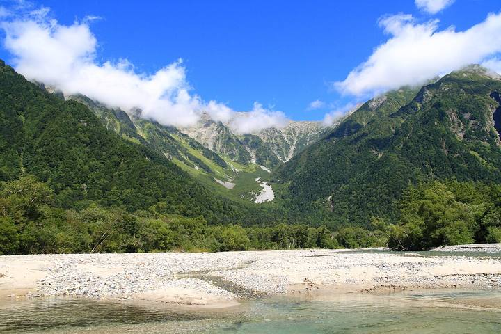

<nav class="crumb"><a href="/">子連れ宿ナビ</a> › <a href="/areas/北海道/">北海道</a> › <a href="/cities/新冠町/">新冠町</a></nav>
<header class="hero">
<figure class="ph"><picture><source media="(max-width:739px)" srcset="https://img.travel.rakuten.co.jp/HIMG/300/55432.jpg"></picture><figcaption class="credit">画像: 楽天トラベル</figcaption></figure>
<a href="https://hb.afl.rakuten.co.jp/hgc/52ba661c.11c9d9e2.52ba661d.9fa5c02a/?pc=https%3A%2F%2Fimg.travel.rakuten.co.jp%2Fimage%2Ftr%2Fapi%2Fif%2FuPw0Q%2F%3Ff_no%3D55432" target="_blank" rel="nofollow sponsored">この宿の空室・料金を見る（楽天トラベルで見る）</a>

<h1>夕陽と音楽を堪能する眺望リゾート　新冠温泉　ホテルヒルズ｜新冠町の子連れにやさしい宿</h1>

北海道新冠郡新冠町西泊津16-3 ・ 1泊 10,200円〜

★4.42 （楽天トラベル 口コミ992件）

</header>

【ブロンズアワード2021受賞】真っ赤に染まる夕陽と音楽に癒される〜2022年4月温泉リニューアル〜

夕陽と音楽を堪能する眺望リゾート　新冠温泉　ホテルヒルズは、新冠町にある総合★4.42（楽天トラベルの口コミ992件）の宿です。子連れ・赤ちゃん連れのご家族からは、「子供が遊べる施設が充実」・「ウェルカムベビー認定」といった点が口コミで支持されています。このページでは、楽天トラベルの口コミから子連れ目線のポイントをまとめました（1泊 10,200円〜）。

◎ お世話

ベビー用品・お世話しやすい設備

○ 安全・添い寝

添い寝・小さな子も安心の部屋

○ 食事・アレルギー

離乳食・アレルギー・部屋食など

<h2>口コミでわかる、子連れにおすすめな理由</h2>

接客「従業員さんはみなさんとても親切で、子どもたちにも優しく接してくれありがたかったです」

設備「小さいお子さん連れにも対応するアメニティーなど用意されていましたので、その様なご家族の宿として最適ではと思います」

子連れ歓迎「無料のサービスが充実していて、マンガやボードゲームなどもたくさんあり、子どもたちも大満足でした」

食事「お菓子バイキング、子供が喜んでました」

設備「子供向けのアメニティが非常に充実しており有り難かったです」

設備「アメニティや、ベビー用品の貸し出し、どこをとっても大満足で今年は寒い時期だったので、暖かい時期にまた訪れたいと思えるホテルでした」

— 楽天トラベルの口コミより（実際に泊まったご家族の声）

<h2>この宿、子供にうれしい</h2>

子供が遊べる施設が充実

遊び場やアクティビティで、子供を退屈させない

お部屋が広くてのびのび

端から端まで動き回れる広さで、子供ものびのび

<h2>パパママにうれしい</h2>

ウェルカムベビー認定

赤ちゃん連れ歓迎が、第三者に認定された宿

貸切・家族風呂

人目を気にせず、子供と一緒にゆっくり入れる

この宿の「子連れにいい」の根拠（口コミ・公式情報）
<ul><li>口コミキッズスペースやスタンプラリー、テラスで遊べるおもちゃなど、小さい子どもでも楽しく遊べる空間がたくさんありました</li><li>口コミホテルの庭の芝生も広く、子供達はのびのび走り回って楽しそうでした</li><li>口コミウェルカムベビーなら親の負担軽減も考慮してほしいです</li><li>公式公式: 風呂種別に家族風呂あり</li></ul>

<h2>お部屋</h2><figure class="ph"><figcaption class="credit">画像: 楽天トラベル</figcaption></figure>
<a href="https://hb.afl.rakuten.co.jp/hgc/52ba661c.11c9d9e2.52ba661d.9fa5c02a/?pc=https%3A%2F%2Fimg.travel.rakuten.co.jp%2Fimage%2Ftr%2Fapi%2Fif%2FuPw0Q%2F%3Ff_no%3D55432" target="_blank" rel="nofollow sponsored">客室つきプランを見る（楽天トラベルで見る）</a>

<h2>子連れにうれしい設備</h2>
湯沸かしポット加湿器(貸出)ゲームコーナー

<h2>お食事</h2><figure class="ph"><figcaption class="credit">※写真はイメージです</figcaption></figure>
夕食はレストランで。食事の口コミ評価は★4.51

<h2>お風呂</h2><figure class="ph"><figcaption class="credit">※写真はイメージです</figcaption></figure>
大浴場・露天風呂・サウナ・家族風呂など。お風呂の口コミ評価は★4.5

<h2>子連れ目線の評価</h2>

食事4.51

お風呂4.5

客室4.29

接客4.37

立地4.53

設備4.39

<h2>泊まった人の声</h2><blockquote class="rev">「従業員さんはみなさんとても親切で、子どもたちにも優しく接してくれありがたかったです」<cite>— 楽天トラベルの口コミより</cite></blockquote>

<h2>ほかにも、こんな口コミがありました</h2><ul class="voices"><li>設備「また、3歳の子供のためにアメニティをはじめ、色々配慮頂いてありがたかったです」</li><li>遊び「キッズスペースやスタンプラリー、テラスで遊べるおもちゃなど、小さい子どもでも楽しく遊べる空間がたくさんありました」</li><li>子連れ歓迎「子連れでも快適に過ごすことができ感謝です」</li><li>子連れ歓迎「娘や孫たちも、早速ロビーにある玩具を借りたりと楽しそうです」</li><li>設備「アメニティも充実していて、キッズスペースやシャボン玉等おもちゃの貸出があったため子供も飽きずに過ごすことが出来ていました」</li></ul>
— いずれも楽天トラベルに寄せられた、実際に泊まったご家族の声です。

<h2>よくある質問</h2>

赤ちゃん・子供の食事はどうなりますか？

夕陽と音楽を堪能する眺望リゾート　新冠温泉　ホテルヒルズの夕食はレストランでいただけます。食事の口コミ評価は★4.51です。口コミには「お菓子バイキング、子供が喜んでました」といった声もありました。離乳食やアレルギー対応は宿により異なるため、予約時にご確認ください。

子連れでもお風呂に入りやすいですか？

夕陽と音楽を堪能する眺望リゾート　新冠温泉　ホテルヒルズには大浴場・露天風呂・家族風呂などがあります。貸切・家族風呂があれば、まわりを気にせず子供と入れます。

夕陽と音楽を堪能する眺望リゾート　新冠温泉　ホテルヒルズは子連れ・赤ちゃん連れにおすすめですか？

新冠町にある夕陽と音楽を堪能する眺望リゾート　新冠温泉　ホテルヒルズは、楽天トラベルの口コミ992件で総合★4.42。本ページでは、その口コミから子連れ目線で評価の高かったポイントをまとめています。

<h2>このエリアの雰囲気</h2><figure class="ph"><figcaption class="credit">※写真はイメージです</figcaption></figure>

★4.42・口コミ992件のこの宿、空いてる日をチェック

<a class="btn" href="https://hb.afl.rakuten.co.jp/hgc/52ba661c.11c9d9e2.52ba661d.9fa5c02a/?pc=https%3A%2F%2Fimg.travel.rakuten.co.jp%2Fimage%2Ftr%2Fapi%2Fif%2FuPw0Q%2F%3Ff_no%3D55432" target="_blank" rel="nofollow sponsored">
空室・料金を楽天トラベルで見る →</a>
<a href="https://hb.afl.rakuten.co.jp/hgc/52ba661c.11c9d9e2.52ba661d.9fa5c02a/?pc=https%3A%2F%2Fimg.travel.rakuten.co.jp%2Fimage%2Ftr%2Fapi%2Fif%2FuPw0Q%2F%3Ff_no%3D55432" target="_blank" rel="nofollow sponsored">料金・割引クーポンも見る →</a>

※当サイトは楽天トラベルのアフィリエイトプログラムを利用しています。

#子連れ旅行 #子連れ温泉 #子連れ宿 #家族旅行 #赤ちゃん連れ旅行 #子連れ旅 #温泉旅行 #子連れお出かけ #ファミリー旅行 #子連れ宿ナビ

<footer class="credits"><h3>イメージ写真クレジット</h3><ul><li>AEON-Mall-Makuhari-Shintoshin 11 2021-11.jpg by RuinDig/Yuki Uchida / CC BY 4.0（<a href="https://upload.wikimedia.org/wikipedia/commons/thumb/d/d6/AEON-Mall-Makuhari-Shintoshin_11_2021-11.jpg/1280px-AEON-Mall-Makuhari-Shintoshin_11_2021-11.jpg" rel="nofollow">出典</a>）</li><li>Bokido of Hotel Urashima01o4592.jpg by 663highland / CC BY 2.5（<a href="https://upload.wikimedia.org/wikipedia/commons/thumb/a/a2/Bokido_of_Hotel_Urashima01o4592.jpg/1280px-Bokido_of_Hotel_Urashima01o4592.jpg" rel="nofollow">出典</a>）</li><li>Kamikōchi, Hida Mountains range, Nagano Prefecture; September 2007 (01).jpg by skyseeker / CC BY 2.0（<a href="https://upload.wikimedia.org/wikipedia/commons/thumb/a/a7/Kamik%C5%8Dchi%2C_Hida_Mountains_range%2C_Nagano_Prefecture%3B_September_2007_%2801%29.jpg/1280px-Kamik%C5%8Dchi%2C_Hida_Mountains_range%2C_Nagano_Prefecture%3B_September_2007_%2801%29.jpg" rel="nofollow">出典</a>）</li></ul></footer>
