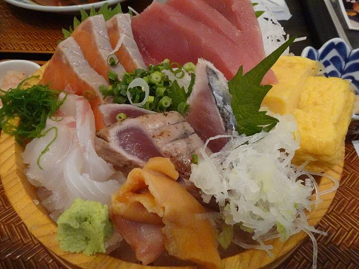
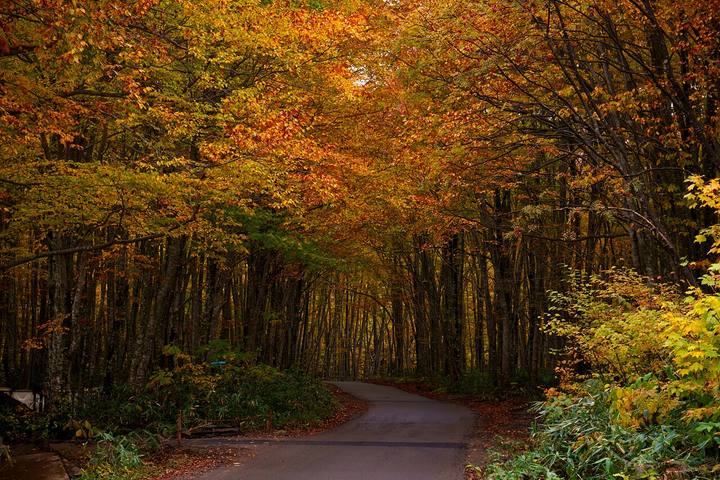

<nav class="crumb"><a href="/">子連れ宿ナビ</a> › <a href="/areas/茨城県/">茨城県</a> › <a href="/cities/ひたちなか市/">ひたちなか市</a></nav>
<header class="hero">
<figure class="ph"><picture><source media="(max-width:739px)" srcset="https://img.travel.rakuten.co.jp/HIMG/300/68487.jpg"></picture><figcaption class="credit">画像: 楽天トラベル</figcaption></figure>
<a href="https://hb.afl.rakuten.co.jp/hgc/52ba661c.11c9d9e2.52ba661d.9fa5c02a/?pc=https%3A%2F%2Fimg.travel.rakuten.co.jp%2Fimage%2Ftr%2Fapi%2Fif%2FuPw0Q%2F%3Ff_no%3D68487" target="_blank" rel="nofollow sponsored">この宿の空室・料金を見る（楽天トラベルで見る）</a>

<h1>いそざき温泉　ホテルニュー白亜紀｜ひたちなか市の子連れにやさしい宿</h1>

茨城県ひたちなか市磯崎町4604 ・ 1泊 7,480円〜

★4.38 （楽天トラベル 口コミ1531件）

</header>

19年4月新しい客室誕生♪温泉露天風呂や客室から海一望！旬の和食会席膳が好評♪ひたち海浜公園車約9分

いそざき温泉　ホテルニュー白亜紀は、ひたちなか市にある総合★4.38（楽天トラベルの口コミ1531件）の宿です。子連れ・赤ちゃん連れのご家族からは、「赤ちゃんグッズが充実」・「ウェルカムベビー認定」といった点が口コミで支持されています。このページでは、楽天トラベルの口コミから子連れ目線のポイントをまとめました（1泊 7,480円〜）。

◎ お世話

ベビー用品・お世話しやすい設備

○ 安全・添い寝

添い寝・小さな子も安心の部屋

○ 食事・アレルギー

離乳食・アレルギー・部屋食など

<h2>口コミでわかる、子連れにおすすめな理由</h2>

設備「子連れでしたが、子供が使いそうなものも、全てお部屋に準備してくださってました(補助便座、オムツゴミ箱、踏み台など」

子連れ歓迎「設備も整っており、温かいおもてなしがたくさんあり、小さなお子さんがいても安心して旅行に行けます」

お風呂「海側で、なおかつ露天風呂があるため仕方がないとは思うが、子供が触るためできれば綺麗だと嬉しい」

お風呂「温泉もよく、子供は喜んで無料の湯上がりアイスを食べてました」

お風呂「ベビーバスの貸し出しがあり、脱衣所にはベビーベッドもあったのでワンオペでも入れることができました」

子連れ歓迎「宿泊客の多くは子連れで、お客さんの総数も多くないので、安心してゆったり過ごせました☺️」

— 楽天トラベルの口コミより（実際に泊まったご家族の声）

<h2>この宿、子供にうれしい</h2>

赤ちゃんグッズが充実

バンボやベビーバスまであって、赤ちゃん連れも手ぶらでOK

子供が遊べる施設が充実

遊び場やアクティビティで、子供を退屈させない

<h2>パパママにうれしい</h2>

ウェルカムベビー認定

赤ちゃん連れ歓迎が、第三者に認定された宿

ベビーベッド完備

持ち込み不要で、赤ちゃん連れも身軽に泊まれる

この宿の「子連れにいい」の根拠（口コミ・公式情報）
<ul><li>口コミベビーバスの貸し出しがあり、脱衣所にはベビーベッドもあったのでワンオペでも入れることができました</li><li>口コミ小さい子を連れての連泊でしたが、キッズスペースなどあり、子供も楽しめました</li><li>口コミ今回、「ウェルカムベビーのお宿」ということで、2ヶ月半の子どもを連れて、祖父母を含む計5名で宿泊しました</li><li>口コミベビーバスの貸し出しがあり、脱衣所にはベビーベッドもあったのでワンオペでも入れることができました</li></ul>

<h2>お部屋</h2><figure class="ph"><figcaption class="credit">画像: 楽天トラベル</figcaption></figure>
<a href="https://hb.afl.rakuten.co.jp/hgc/52ba661c.11c9d9e2.52ba661d.9fa5c02a/?pc=https%3A%2F%2Fimg.travel.rakuten.co.jp%2Fimage%2Ftr%2Fapi%2Fif%2FuPw0Q%2F%3Ff_no%3D68487" target="_blank" rel="nofollow sponsored">客室つきプランを見る（楽天トラベルで見る）</a>

<h2>子連れにうれしい設備</h2>
湯沸かしポット加湿器

<h2>お食事</h2><figure class="ph"><figcaption class="credit">※写真はイメージです</figcaption></figure>
夕食はレストランで。食事の口コミ評価は★4.51

<h2>お風呂</h2><figure class="ph"><figcaption class="credit">※写真はイメージです</figcaption></figure>
大浴場・露天風呂・天然温泉など。お風呂の口コミ評価は★4.3

<h2>子連れ目線の評価</h2>

食事4.51

お風呂4.3

客室4.31

接客4.48

立地4.35

設備4.12

<h2>泊まった人の声</h2><blockquote class="rev">「ひたち海浜公園もすぐそばで立地が最高なうえ、神経質な子どもがまた行きたいと言っているため、気になる点が改善されれば絶対行きたいと思います」<cite>— 楽天トラベルの口コミより</cite></blockquote>

<h2>ほかにも、こんな口コミがありました</h2><ul class="voices"><li>食事「お部屋もかわいいし、ご飯もおいしくて夫も子供もまた行きたいと言っているため是非よろしくお願いします」</li><li>食事「施設、早く自体は古さがありましたが、夕食朝食が子供も大人も満足する内容、おいしさでした」</li><li>子連れ歓迎「子供がまた行きたいと言っています」</li><li>遊び「小さい子を連れての連泊でしたが、キッズスペースなどあり、子供も楽しめました」</li></ul>
— いずれも楽天トラベルに寄せられた、実際に泊まったご家族の声です。

<h2>よくある質問</h2>

赤ちゃん・子供の食事はどうなりますか？

いそざき温泉　ホテルニュー白亜紀の夕食はレストランでいただけます。食事の口コミ評価は★4.51です。口コミには「朝食バイキングがすごく良かったので、子どもは夕飯もバイキングが良かった…と言っていました」といった声もありました。離乳食やアレルギー対応は宿により異なるため、予約時にご確認ください。

子連れでもお風呂に入りやすいですか？

いそざき温泉　ホテルニュー白亜紀には大浴場・露天風呂などがあります。貸切・家族風呂があれば、まわりを気にせず子供と入れます。

いそざき温泉　ホテルニュー白亜紀は子連れ・赤ちゃん連れにおすすめですか？

ひたちなか市にあるいそざき温泉　ホテルニュー白亜紀は、楽天トラベルの口コミ1531件で総合★4.38。本ページでは、その口コミから子連れ目線で評価の高かったポイントをまとめています。

<h2>このエリアの雰囲気</h2><figure class="ph"><figcaption class="credit">※写真はイメージです</figcaption></figure>

★4.38・口コミ1531件のこの宿、空いてる日をチェック

<a class="btn" href="https://hb.afl.rakuten.co.jp/hgc/52ba661c.11c9d9e2.52ba661d.9fa5c02a/?pc=https%3A%2F%2Fimg.travel.rakuten.co.jp%2Fimage%2Ftr%2Fapi%2Fif%2FuPw0Q%2F%3Ff_no%3D68487" target="_blank" rel="nofollow sponsored">
空室・料金を楽天トラベルで見る →</a>
<a href="https://hb.afl.rakuten.co.jp/hgc/52ba661c.11c9d9e2.52ba661d.9fa5c02a/?pc=https%3A%2F%2Fimg.travel.rakuten.co.jp%2Fimage%2Ftr%2Fapi%2Fif%2FuPw0Q%2F%3Ff_no%3D68487" target="_blank" rel="nofollow sponsored">料金・割引クーポンも見る →</a>

※当サイトは楽天トラベルのアフィリエイトプログラムを利用しています。

#子連れ旅行 #子連れ温泉 #子連れ宿 #家族旅行 #赤ちゃん連れ旅行 #子連れ旅 #温泉旅行 #子連れお出かけ #ファミリー旅行 #子連れ宿ナビ

<footer class="credits"><h3>イメージ写真クレジット</h3><ul><li>AEON-Mall-Makuhari-Shintoshin 11 2021-11.jpg by RuinDig/Yuki Uchida / CC BY 4.0（<a href="https://upload.wikimedia.org/wikipedia/commons/thumb/d/d6/AEON-Mall-Makuhari-Shintoshin_11_2021-11.jpg/1280px-AEON-Mall-Makuhari-Shintoshin_11_2021-11.jpg" rel="nofollow">出典</a>）</li><li>Bokido of Hotel Urashima01o4592.jpg by 663highland / CC BY 2.5（<a href="https://upload.wikimedia.org/wikipedia/commons/thumb/a/a2/Bokido_of_Hotel_Urashima01o4592.jpg/1280px-Bokido_of_Hotel_Urashima01o4592.jpg" rel="nofollow">出典</a>）</li><li>Beech forest in Nyuto Onsenkyo (1).jpg by 掬茶 / CC BY-SA 4.0（<a href="wikimedia" rel="nofollow">出典</a>）</li></ul></footer>
