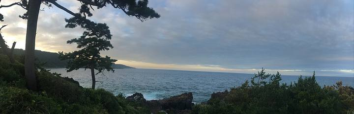

<nav class="crumb"><a href="/">子連れ宿ナビ</a> › <a href="/areas/兵庫県/">兵庫県</a> › <a href="/cities/洲本市/">洲本市</a></nav>
<header class="hero">
<figure class="ph"><picture><source media="(max-width:739px)" srcset="https://img.travel.rakuten.co.jp/HIMG/300/9104.jpg"></picture><figcaption class="credit">画像: 楽天トラベル</figcaption></figure>
<a href="https://hb.afl.rakuten.co.jp/hgc/52ba661c.11c9d9e2.52ba661d.9fa5c02a/?pc=https%3A%2F%2Fimg.travel.rakuten.co.jp%2Fimage%2Ftr%2Fapi%2Fif%2FuPw0Q%2F%3Ff_no%3D9104" target="_blank" rel="nofollow sponsored">この宿の空室・料金を見る（楽天トラベルで見る）</a>

<h1>洲本温泉　淡路インターナショナルホテル　ザ・サンプラザ　＜淡路島＞｜洲本市の子連れにやさしい宿</h1>

兵庫県洲本市小路谷1279-13 ・ 1泊 10,230円〜

★4.4 （楽天トラベル 口コミ3008件）

</header>

海を一望するオーシャンビューに包まれ、四季の移ろいを五感で味わう、特別な旅を。洲本温泉うるおいの湯。

洲本温泉　淡路インターナショナルホテル　ザ・サンプラザ　＜淡路島＞は、洲本市にある総合★4.4（楽天トラベルの口コミ3008件）の宿です。子連れ・赤ちゃん連れのご家族からは、「赤ちゃんグッズが充実」・「子供が騒いでも大丈夫」といった点が口コミで支持されています。このページでは、楽天トラベルの口コミから子連れ目線のポイントをまとめました（1泊 10,230円〜）。

○ お世話

ベビー用品・お世話しやすい設備

○ 安全・添い寝

添い寝・小さな子も安心の部屋

◎ 食事・アレルギー

離乳食・アレルギー・部屋食など

<h2>口コミでわかる、子連れにおすすめな理由</h2>

お風呂「貸切風呂でも、大きめのベビーバスやアップリカのバスチェア、おもちゃ、肌にやさしい泡タイプのボディソープなどを用意してくださっており助かりました」

設備「コンセントのカバーや、オムツ捨て用のゴミ箱（外に臭いが漏れない物）、哺乳瓶洗い用のグッズ、バンボ（赤ちゃん用の椅子）などを用意してくださっていました」

子連れ歓迎「孫（幼児）連れだった非常に助かりました」

遊び「今年から子供も遊べる滑り台付きの遊具が追加されていて、子どももとても喜んでいました」

接客「スタッフの皆さんも子どもたちに優しく声をかけてくださり、家族みんなで楽しく快適に過ごすことができました」

食事「お料理はとても美味しく子連れだったので部屋食でゆっくり周りを気にせず食べれて大満足です」

— 楽天トラベルの口コミより（実際に泊まったご家族の声）

<h2>この宿、子供にうれしい</h2>

赤ちゃんグッズが充実

バンボやベビーバスまであって、赤ちゃん連れも手ぶらでOK

焚き火や花火で大はしゃぎ

外遊びや花火で、子供がとびきりの笑顔に

<h2>パパママにうれしい</h2>

子供が騒いでも大丈夫

多少さわいでも、気兼ねなく過ごせる雰囲気

お部屋・個室で部屋食

人目を気にせず、子供を見ながらゆっくり食べられる

この宿の「子連れにいい」の根拠（口コミ・公式情報）
<ul><li>口コミお風呂もベビーバスがあったりと</li><li>口コミ孫には花火のプレゼントや縁日などがあり</li><li>口コミお料理はとても美味しく子連れだったので部屋食でゆっくり周りを気にせず食べれて大満足です</li><li>口コミ子供が小さいので、貸切風呂と部屋食のプランにしました</li></ul>

<h2>お部屋</h2><figure class="ph"><figcaption class="credit">画像: 楽天トラベル</figcaption></figure>
<a href="https://hb.afl.rakuten.co.jp/hgc/52ba661c.11c9d9e2.52ba661d.9fa5c02a/?pc=https%3A%2F%2Fimg.travel.rakuten.co.jp%2Fimage%2Ftr%2Fapi%2Fif%2FuPw0Q%2F%3Ff_no%3D9104" target="_blank" rel="nofollow sponsored">客室つきプランを見る（楽天トラベルで見る）</a>

<h2>子連れにうれしい設備</h2>
プール(夏期のみ)屋外プールゲームコーナー

<h2>お食事</h2><figure class="ph"><figcaption class="credit">※写真はイメージです</figcaption></figure>
夕食はお部屋（部屋食）・レストランで。食事の口コミ評価は★4.55

<h2>お風呂</h2><figure class="ph"><figcaption class="credit">※写真はイメージです</figcaption></figure>
露天風呂・サウナ・天然温泉など。お風呂の口コミ評価は★4.37

<h2>子連れ目線の評価</h2>

食事4.55

お風呂4.37

客室4.3

接客4.51

立地4.54

設備4.17

<h2>泊まった人の声</h2><blockquote class="rev">「貸切風呂でも、大きめのベビーバスやアップリカのバスチェア、おもちゃ、肌にやさしい泡タイプのボディソープなどを用意してくださっており助かりました」<cite>— 楽天トラベルの口コミより</cite></blockquote>

<h2>ほかにも、こんな口コミがありました</h2><ul class="voices"><li>お風呂「また赤ちゃんにも優しくコンセントカバーやバンボお風呂の椅子やおもちゃ哺乳瓶消毒などのサービスがありとても助かりました」</li><li>お風呂「貸切風呂も気持ちよくて、イヤイヤ期の子供も喜んで入ってました」</li><li>子連れ歓迎「妊婦さんや家族連れにおすすめのお宿で、子供が産まれたらまた来たいねと話しています」</li><li>食事「3歳児との宿泊だったのでお部屋食を選択しましたが、ご飯も美味しく子供も美味しく食べる事ができました」</li><li>食事「お部屋でいただく食事もとても美味しく、子どもたちもたくさん食べてくれて大満足でした」</li><li>接客「部屋からは海が一望でき、スタッフさんも親切で子供慣れしていて、料理も美味しく、全体的に非常に満足です」</li></ul>
— いずれも楽天トラベルに寄せられた、実際に泊まったご家族の声です。

<h2>よくある質問</h2>

赤ちゃん・子供の食事はどうなりますか？

洲本温泉　淡路インターナショナルホテル　ザ・サンプラザ　＜淡路島＞の夕食はお部屋（部屋食）・レストランでいただけます。食事の口コミ評価は★4.55です。口コミには「3歳児との宿泊だったのでお部屋食を選択しましたが、ご飯も美味しく子供も美味しく食べる事ができました」といった声もありました。離乳食やアレルギー対応は宿により異なるため、予約時にご確認ください。

子連れでもお風呂に入りやすいですか？

洲本温泉　淡路インターナショナルホテル　ザ・サンプラザ　＜淡路島＞には露天風呂などがあります。貸切・家族風呂があれば、まわりを気にせず子供と入れます。

洲本温泉　淡路インターナショナルホテル　ザ・サンプラザ　＜淡路島＞は子連れ・赤ちゃん連れにおすすめですか？

洲本市にある洲本温泉　淡路インターナショナルホテル　ザ・サンプラザ　＜淡路島＞は、楽天トラベルの口コミ3008件で総合★4.4。本ページでは、その口コミから子連れ目線で評価の高かったポイントをまとめています。

<h2>このエリアの雰囲気</h2><figure class="ph"><figcaption class="credit">※写真はイメージです</figcaption></figure>

★4.4・口コミ3008件のこの宿、空いてる日をチェック

<a class="btn" href="https://hb.afl.rakuten.co.jp/hgc/52ba661c.11c9d9e2.52ba661d.9fa5c02a/?pc=https%3A%2F%2Fimg.travel.rakuten.co.jp%2Fimage%2Ftr%2Fapi%2Fif%2FuPw0Q%2F%3Ff_no%3D9104" target="_blank" rel="nofollow sponsored">
空室・料金を楽天トラベルで見る →</a>
<a href="https://hb.afl.rakuten.co.jp/hgc/52ba661c.11c9d9e2.52ba661d.9fa5c02a/?pc=https%3A%2F%2Fimg.travel.rakuten.co.jp%2Fimage%2Ftr%2Fapi%2Fif%2FuPw0Q%2F%3Ff_no%3D9104" target="_blank" rel="nofollow sponsored">料金・割引クーポンも見る →</a>

※当サイトは楽天トラベルのアフィリエイトプログラムを利用しています。

#子連れ旅行 #子連れ温泉 #子連れ宿 #家族旅行 #赤ちゃん連れ旅行 #子連れ旅 #温泉旅行 #子連れお出かけ #ファミリー旅行 #子連れ宿ナビ

<footer class="credits"><h3>イメージ写真クレジット</h3><ul><li>AEON-Mall-Makuhari-Shintoshin 11 2021-11.jpg by RuinDig/Yuki Uchida / CC BY 4.0（<a href="https://upload.wikimedia.org/wikipedia/commons/thumb/d/d6/AEON-Mall-Makuhari-Shintoshin_11_2021-11.jpg/1280px-AEON-Mall-Makuhari-Shintoshin_11_2021-11.jpg" rel="nofollow">出典</a>）</li><li>Bokido of Hotel Urashima01o4592.jpg by 663highland / CC BY 2.5（<a href="https://upload.wikimedia.org/wikipedia/commons/thumb/a/a2/Bokido_of_Hotel_Urashima01o4592.jpg/1280px-Bokido_of_Hotel_Urashima01o4592.jpg" rel="nofollow">出典</a>）</li><li>Izu peninsula UNESCO geopark 2022 Sept 12 various 18 34 43 702000.jpeg by Nesnad / CC BY 4.0（<a href="https://upload.wikimedia.org/wikipedia/commons/thumb/2/27/Izu_peninsula_UNESCO_geopark_2022_Sept_12_various_18_34_43_702000.jpeg/1280px-Izu_peninsula_UNESCO_geopark_2022_Sept_12_various_18_34_43_702000.jpeg" rel="nofollow">出典</a>）</li></ul></footer>
